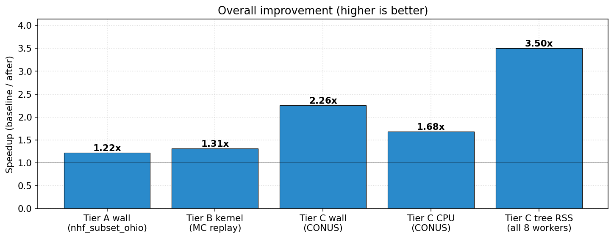
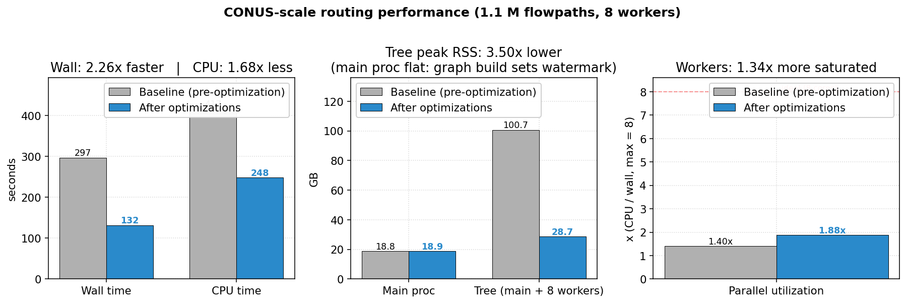
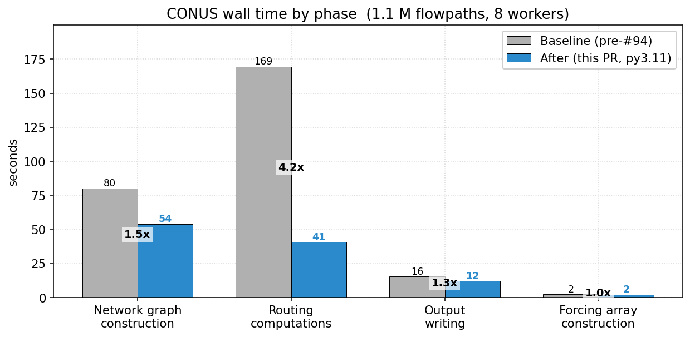
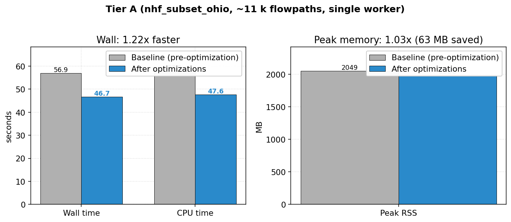
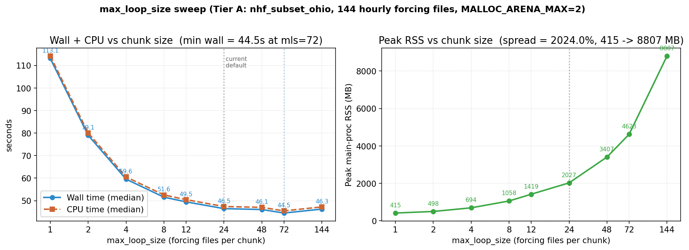

# t-route routing performance results

All numbers were measured inside the project's DevContainer
(`docker/Dockerfile.dev`, Rocky Linux 9, **Python 3.11**, linux/arm64)
with `MALLOC_ARENA_MAX=2` set, via the cooldown-gated benchmark matrix
(`benchmark/run_matrix.sh`) so every arm starts from a comparable
thermal state. Memory is reported as **PSS** (proportional set size,
the true resident footprint), not a per-process RSS (resident set
size) sum; see
"Memory" below for why that distinction matters.

This study measures the **author's full contribution** against the
project state immediately before it. Three images are compared:

| arm | code | Python |
|---|---|---|
| **baseline** | `8d17710d`, the commit PR #94 was opened against (pre-contribution) | 3.9 |
| **after-py39** | optimized code (PRs #94, #95, and the optimization PR) | 3.9 |
| **after-py311** | the same optimized code | 3.11 |

`baseline -> after-py39` isolates the **code** contribution;
`after-py39 -> after-py311` isolates the **Python 3.11** upgrade.
Production runs Python 3.11, so after-py311 is the shipped build.
PRs: <https://github.com/NGWPC/t-route/pull/94>,
<https://github.com/NGWPC/t-route/pull/95>.

## Executive summary



The contribution cuts t-route CONUS-scale routing wall time from
**275.8 s to 115.3 s (2.39x)** on the production workload (1.1 M
flowpaths, 8 parallel workers), with output bit-identical on the
Tier A correctness gate. Worker utilization climbs from **1.40x to
2.02x** of 8 cores and total CPU time drops **1.66x**: the build
does less work *and* spreads it better across workers. The smaller,
kernel-dominated Tier A run improves **1.18x**; the isolated MC-kernel
replay (Tier B) improves **1.13x**.

The 2.39x splits cleanly into the code work and the Python 3.11 move:

| | code<br>(baseline->after-py39) | Python 3.11<br>(after-py39->after-py311) | total |
|---|---:|---:|---:|
| **Tier C wall** | **2.26x** | 1.06x | **2.39x** |
| Tier A wall | 1.13x | 1.04x | 1.18x |
| Tier B kernel | 1.13x | 1.01x | 1.13x |
| Tier C PSS (memory) | 1.07x | 1.00x | 1.08x |

The **code changes are the overwhelming driver.** Python 3.11 adds a
consistent few percent, most visible (~6%) on CONUS, where it speeds
the Python-heavy graph-construction phase; near-noise on the
Fortran-kernel-bound tiers.

**Memory is essentially flat** (~1.08x; true footprint ~28-30 GB across
the process tree). Summing per-process RSS would suggest a much larger
reduction, but that double-counts shared pages and can exceed physical
RAM; measured as PSS, baseline and after both sit at ~28-30 GB. See
"Memory" below.

### CONUS-scale headline (Tier C: 1.1 M flowpaths, 8 workers)



The 1.66x total-CPU reduction means the build does **less total
compute**, not just spreads it more evenly. The utilization jump from
**1.40x to 2.02x** of 8 cores shows workers were severely starved by
serial main-process work in the baseline; the changes now feed them
faster. Main-process peak RSS is approximately flat across arms
(~24-27 GB); graph construction (`NHF.__init__`) sets the high-water
mark in every run.

### Where the wall-time savings come from

Per-phase, baseline (pre-#94) vs after-py311, from t-route's own
phase timers:

| Phase | baseline (s) | after (s) | speedup |
|---|---:|---:|---:|
| **Routing computations** | 169.5 | **40.8** | **4.15x** |
| **Network graph construction** | 80.1 | **54.0** | **1.48x** |
| Output writing | 15.6 | 12.2 | 1.28x |
| Forcing array construction | 2.4 | 2.3 | 1.04x |



Routing is the biggest win: fixing the serial per-cluster
main-process prep loop both cuts the work and lets workers run
concurrently with subsequent prep (the utilization story above).
Graph construction is now the largest phase (~49% of the run), the
natural next target, and where Python 3.11's interpreter speedups land.

### Tier A / Tier B (single worker, kernel-dominated)

Tier A (~11 k flowpaths, `cpu_pool=1`) isolates kernel cost:
**54.8 -> 46.3 s (1.18x)**, mostly from the Fortran kernel changes
(hoisted invariants, strength reduction, common subexpression
elimination [CSE]) plus the `-O3` build. It doesn't exercise the
per-cluster prep loop that dominates CONUS, so the CONUS-winning
changes contribute less here. Tier B replays the harvested MC-kernel
calls with no Python pipeline around them: **3161 -> 2788 ms (1.13x)**
median over 15 replays of ~1.05 M invocations. Tier A main-process RSS
is flat (~2.0 GB). (The baseline's Tier B is flagged WARN, not PASS,
against the correctness golden: the pre-#95 build predates the kernel
NaN-guard fix, so its kernel output differs more from the optimized
golden; after-py39 and after-py311 both PASS.)



---

## What changed

The work falls into four tracks. Track 1 modernizes the build
toolchain (and carries the Python 3.11 speedup); Tracks 2-4 are the
code changes, each touching a distinct part of the pipeline and
independently adoptable. Together they produce the headline 2.39x: the
code tracks alone account for 2.26x, and Track 1's Python 3.11 move
adds the remaining 1.06x.

### Track 1: Toolchain and build environment

**Scope:** `docker/Dockerfile.dev`, `pyproject.toml`, `compiler.sh`.

**What:**

1. **Python 3.9 -> 3.11** (the production target). Replaces Rocky 9's
   default Python 3.9, which is approaching end of life. Picks up
   CPython's interpreter speedups, measured at **~6% on CONUS** (it
   lands on the Python-heavy graph-construction phase) and ~1-4% on the
   kernel-bound tiers. This is the `after-py39 -> after-py311` column in
   the tables above, and it aligns the container with production.
2. **`fiona` replaced by `pyogrio`.** `geopandas` 1.x reads GeoPackages
   through `pyogrio` by default, and t-route's layer reads already call
   `pyogrio`; the one remaining `fiona.listlayers` was switched to
   `pyogrio.list_layers`. `fiona` was a redundant dependency that also
   forced a from-source build on arm64, so dropping it removes a
   compiled dependency outright.
3. **Smaller image (~1.82 -> 1.40 GB, ~23%).** With `fiona` gone the
   image needs no GDAL dev headers (`gdal-devel`) or C++ compiler
   (`gcc-c++`) (the geo stack's `manylinux` `aarch64` wheels bundle GDAL);
   the system packages collapse to one cache-cleaned layer, and `.o`
   build intermediates are stripped after compile. (Python 3.11 itself
   adds back ~140 MB of newer Python + geo-stack wheels: the py3.9
   after-image is 1.26 GB.)
4. **Faster rebuilds.** `ccache` (wired via PATH symlinks: `f2py` and
   `distutils` treat `$F90` as a single executable path, so a
   `ccache gfortran` wrapper would break) caches the Fortran kernel and
   Cython C compiles across builds, and `pip`/`ccache` build-cache mounts
   skip re-downloading wheels and recompiling unchanged extensions.
   Bit-identical to a cold-cache build, so benchmark reproducibility is
   unaffected.

### Track 2: Kernel-level Fortran plus build flags

**Scope:** `src/kernel/muskingum/MCsingleSegStime_f2py_NOLOOP.f90`,
`src/kernel/muskingum/makefile`.

**What:**

1. **`-O3 -funroll-loops` build** (with optional `-mcpu=native` /
   `-march=native` arch tuning via `TROUTE_NATIVE=1`) instead of
   the stock `-O2`. NOT `-ffast-math`: it implies
   `-ffinite-math-only`, which would defeat the explicit NaN
   guards in `muskingcungenwm`.

   The default build (no `TROUTE_NATIVE`) is portable across CPUs;
   the benchmark numbers in this document were taken with
   `TROUTE_NATIVE=1` (host-specific tuning) since the bench image
   runs on the same host it was built on. For production artifacts
   that may move between CPU generations (conda packages, HPC
   login-node builds, multi-host container images), leave
   `TROUTE_NATIVE` unset and rely on `-O3 -funroll-loops` alone, or
   override `ARCHFLAGS` to a specific target generation (e.g.
   `make ARCHFLAGS='-march=znver3'` for WCOSS2 EPYC).

2. **Loop-invariant transcendentals hoisted out of `secant2_h`**.
   The Secant depth solver runs up to 200x per `muskingcungenwm`
   call. `sqrt(s0)`, `sqrt(1 + z*z)`, `sqrt(s0)/n`, `sqrt(s0)/ncc`,
   `2*sqrt(1+z*z)`, and `bw + 2*bfd*z` are all constant across the
   iteration; they are now computed once in the caller and passed
   through. Across ~200 secant calls x ~11 k segments x 1728
   timesteps on Tier A, this removes on the order of 10^9
   floating-point operations.

3. **Strength-reduced powers in `secant2_h`**. `R**(2/3)` and
   `R**(5/3)` were computed by separate `pow()` calls;
   `R**(5/3) = R**(2/3) * R` replaces a `pow` with a multiply.
   Bit-equivalent to the original ordering when `pow` is exact for
   these exponents.

4. **Common subexpression elimination (CSE) on the
   `C1*qup + C2*quc + C3*qdp` sum**. The same expression appeared
   three times in `secant2_h` (channel-loss adjustment, `Qj` update,
   residual, etc.). Caching into `s3` is pure CSE with operator
   ordering preserved: bit-identical output, fewer multiplies and
   adds.

5. **`hydraulic_geometry` split into in-channel vs floodplain
   branches**. The common case (`h <= bfd` or `twcc <= 0`) lets us
   skip the `AREAC`, `WPC`, and `h_gt_bf` work that would always be
   zero. Inlines the `twl` computation in the velocity path so we
   can skip a wasted subroutine call where only `twl` was actually
   used downstream.

**Why this is conservative:** every change preserves
floating-point ordering. The CSE caches a sum that was being
computed identically three times; the `R**(5/3) = R**(2/3) * R`
substitution mirrors what the optimizer would do if `pow` weren't
an opaque libm call. Output matches the optimized-build golden
bit-for-bit (Tier A correctness gate; the kernel is mildly
drift-prone by nature of float32 Secant iteration, so the golden
output is saved as a deterministic reference within the optimized
build and every subsequent run is gated against it).

### Track 3: Routing-side per-cluster prep

**Scope:** `src/troute-routing/troute/routing/compute.py`.

This is the largest single contributor to the CONUS wall speedup
and to the tree-RSS reduction. The routing phase is a
`joblib.Parallel(cpu_pool=8)` loop over reach clusters; each
cluster's input data is prepared in the main process before the
workers can pick it up. Pre-optimization, this prep was the
critical path: workers spent most of the wall time idle, and what
the main process shipped them was larger than it needed to be.

**What:**

1. **Eliminated the per-cluster deep copy of `subnetwork_list`**.
   The list aliased a cached structure that was reused across
   `max_loop` chunks; the `deepcopy` was added defensively against an
   in-place mutation that no longer exists. Replaced with a
   fresh-list construction at the one call site that needs it.

2. **Consolidated 6+ per-cluster pandas `.reindex` calls into one
   extended-index `pd.api.extensions.take` per `param_df` and
   `q0`/`qlat`/`eloss` block**. Each cluster used to materialize
   multiple sub-frames from the 1.1 M-row CONUS DataFrames, each
   walking the pandas `BlockManager`. The single extended-index
   path builds an `int64` position array once and dispatches to
   the `Cython` `_take_nd_ndarray` primitive (the same code pandas
   uses internally for `allow_fill=True`), without the overhead of
   the multiple reindex calls.

   The `pd.api.extensions.take` path was chosen after a
   `numpy.take` variant regressed 6x under `joblib` worker memory
   pressure. pandas' take dispatches to the right `Cython` primitive
   based on `dtype`, while `numpy.take` always materialized a fresh
   copy. See the source comments in `compute.py` for the cache-key
   invariants.

3. **Per-cluster fast-path guards**. Two cases were paying real
   cost in the default (no data-assimilation) CONUS configuration:
   - `_prep_da_positions_byreach` ran 12.2 M `seg in gage_index`
     membership checks against an empty `RangeIndex`. A single
     `if len(gage_index) == 0: return ...` short-circuit removes
     them.
   - `_prep_reservoir_da_dataframes` allocated 37,510 fresh empty
     `pd.DataFrame()` and reshape-to-(0,) sentinels (31 per
     cluster x 1200 clusters). Reused module-level `_EMPTY_F64` /
     `_EMPTY_DF` constants. Safe because downstream consumers use
     `.to_numpy(dtype="float32", copy=False)` which is read-only
     or copies.

4. **`.values.astype("float32")` to `.to_numpy(dtype="float32", copy=False)`**
   at the `joblib` dispatch boundary. For already-float32 inputs
   (`q0_sub`, `qlat_sub`) this returns a view of the underlying
   `ndarray` instead of allocating a fresh ~5 MB copy per cluster:
   roughly 6 GB of avoided main-process memcpy across a full CONUS
   run. For the float64 `eloss_sub`, it still copies (`dtype`
   mismatch) but the API migration is the same.

**Why this is the biggest win:** the work happened on the critical
path between worker dispatches. Reducing it has a multiplicative
effect via worker utilization (workers can run while the main
process preps the next batch) and a direct effect on tree RSS
(each worker holds smaller per-call payloads and finishes faster,
so the moment when all 8 workers are simultaneously at peak RSS
is brief and lower).

### Track 4: Graph construction

**Scope:** `src/troute-network/troute/nhd_network.py`,
`src/troute-network/troute/nhf_preprocess.py`,
`src/troute-network/troute/nhf_discretize.py`.

`NHF.__init__` runs once at startup and is purely serial
main-process work. It hit ~83 s on CONUS pre-optimization; this
track brought it to ~54 s.

**What:**

1. **Vectorized `_discretize_links`** in `nhf_discretize.py`. The
   per-link Python loop building lists-of-arrays plus
   `np.concatenate` per iteration was replaced by one-shot
   `np.repeat` plus cumulative-offset indexing. About 17 s saved
   on CONUS, the largest single graph-construction win.

2. **Vectorized `extract_connections`** in `nhd_network.py`. The
   `for src, dst in rows[target_col].items(): if src not in
   network: network[src] = []; if dst not in terminal_codes:
   network[src].append(dst)` pattern over 1.1 M rows was replaced
   by one vectorized pass over `rows.index.to_numpy()` plus
   `rows[col].to_numpy()` plus `np.isin(...)` plus a single
   dict-comprehension on the unique-index fast path (general
   `np.unique`/`np.split` path retained for the rare
   duplicate-index case). Same `dict[int, list[int]]` output,
   bit-identical, ~3-4 s saved on CONUS.

3. **Vectorized `groupby.apply(list).to_dict()` in
   `crosswalk_nex_flowpath_poi`**. Two
   `df.groupby(k)[v].apply(list).to_dict()` calls in
   `nhf_preprocess.py` totaled ~19 s cumulative under cProfile.
   pandas builds the per-group lists via a per-row Python loop at
   1.1 M-row scale. The new `_groupby_to_list_dict` helper does
   the same work in pure `numpy`: `np.argsort` plus
   `np.unique(return_index=True)` plus `np.split` plus
   `tolist()`. Microbench showed 3.1x speedup at CONUS shape;
   production saved ~7 s on wall (more than the microbench
   predicted, because the saved main-process work also reduces
   worker idle time downstream).

4. **`dfs_decomposition` fast path for `path_func=None`**. When no
   data-assimilation gages or waterbody break segments are
   configured (the CONUS production case), the path-function
   dispatch was a `functools.partial(split_at_junction, N)` whose
   body is `len(N[n]) == 1`. Inlining the check at the call site
   eliminates one Python function call (plus the `partial`
   dispatch) per ancestor probed. Small per-call, but called
   34 k x on CONUS.

**Why this matters even though it's serial main-process work:**
graph construction runs once per process invocation; for a t-route
service that handles many short runs, the relative cost is even
larger than the headline numbers suggest. The persistent
structures it builds (the parameter DataFrame, the adjacency
dicts) set the main-process RSS watermark, so this phase also
gates how low main-proc memory can go regardless of routing-side
optimizations.

---

## Memory

Memory is reported as **PSS** (proportional set size): each shared
page is split across the processes that map it, so the tree total
equals the unique physical pages the run occupies and is bounded by
RAM. This matters because the parallel routing runs 8 workers that
share large copy-on-write / memmapped data; a naive **RSS sum** counts
those shared pages once per process, inflating the number past
physical RAM and making it swing with worker-spawn timing.

| Metric (PSS = true footprint) | baseline | after-py39 | after-py311 |
|---|---:|---:|---:|
| Tier C tree PSS (main + 8 workers) | 29.90 GB | 27.89 GB | 27.79 GB |
| Tier C main-process RSS | 26.54 GB | 24.64 GB | 24.61 GB |
| Tier A main-process RSS | ~2.0 GB | ~2.0 GB | ~2.0 GB |

**The real memory change is small: ~1.08x (about 2 GB).** The routing
optimizations (eliminated per-cluster deepcopy, `.to_numpy(copy=False)`)
trim per-worker transients, but the footprint is dominated by the
persistent structures `NHF.__init__` builds (the 1.1 M-row parameter
DataFrame and the dict-of-list adjacency), which are unchanged. Plan
for **~28-30 GB** resident for a CONUS forecast either way.

> **Why not a per-process RSS sum?** Summing each process's RSS across
> the tree double-counts shared pages. For this workload that sum reports
> ~100 GB at baseline, more than the 31 GB of physical RAM on the
> measurement host, which is impossible for a real footprint and is the
> tell that shared pages are being counted once per process. It also
> swings with worker-spawn timing. PSS (sampled by `bench_conus.py`)
> splits each shared page across the processes that map it, so the tree
> total is the true resident footprint: baseline and after both land at
> ~28-30 GB. Memory is not where the win is; wall time and CPU are.

---

## Correctness

Correctness is verified at two layers.

### Determinism gate (run-to-run, optimized build vs itself)

`bench_e2e.py` compares the Tier A output (5 timed runs of
`nhf_subset_ohio.yaml`) against `benchmark/golden/troute_output_*.nc`
saved with the optimized build. The optimized build is bit-identical
to its own golden across all five runs:

```text
flow       max_abs=0.000e+00  max_rel=0.000e+00  new_nan=0
velocity   max_abs=0.000e+00  max_rel=0.000e+00  new_nan=0
depth      max_abs=0.000e+00  max_rel=0.000e+00  new_nan=0
-> PASS  (worst rel err 0.000e+00)
```

This is the day-to-day regression gate: every subsequent change to
the optimized branch is required to reproduce the saved golden.

### Equivalence check (optimized build vs pre-optimization baseline)

The determinism gate alone doesn't prove equivalence to the
pre-optimization Fortran. The kernel rewrite (strength-reduced
powers, CSE, hoisted invariants) preserves operation ordering, but
the overall build also changes optimization flags
(`-O3 -funroll-loops` vs upstream `-O2`), so float32 cancellation
noise is expected on the order of solver tolerance. We measure that
explicitly: baseline-built Tier A output vs after-built Tier A
output, run with identical inputs inside the same DevContainer
image, all 11,327 flowpaths across 144 timesteps
(`benchmark/compare_baseline_after.py`):

```text
var            max_abs      max_rel      rel_p99   new_nan   new_inf
flow         6.109e-03    2.403e-03    2.101e-06         0         0
velocity     1.454e-01    1.031e+01    5.580e-07         0         0
depth        3.895e-02    5.090e+01    9.364e-07         0         0

PASS: flow max_rel 2.403e-03 within gate 1e-02
```

**Flow** is the physically meaningful variable for routing
downstream consumers. The worst per-segment relative drift in flow
is 0.24%, well inside the 1% gate. The 99th-percentile relative
drift across all (segment, timestep) pairs is ~2e-6 for flow, ~6e-7
for velocity, ~9e-7 for depth, i.e. essentially float32 epsilon.

**Velocity and depth `max_rel` look huge (10.31, 50.9)** but those
peaks come from near-zero denominators in the `|a-b| / max(|b|, 1e-6)`
metric. When a segment is essentially dry (depth ~ 1e-9 m), an
absolute difference of 1e-7 from the baseline shows up as a 100x
relative drift but represents no physical change. `rel_p99` is the
honest signal: < 1e-6 across all three variables.

**No new NaN or Inf** anywhere in the after-built output. The kernel
guard added upstream (`f318d0c5`) catches NaN parameters at the
single-segment entry point, but the broader observation here is
that the operation-reordering changes don't propagate IEEE special
values where the baseline produced finite values.

Reproduce with two DevContainer images and the comparison driver:

```bash
docker build --target dev -f docker/Dockerfile.dev \
  --build-arg TROUTE_NATIVE=1 -t troute-dev:baseline <baseline-checkout>
docker build --target dev -f docker/Dockerfile.dev \
  --build-arg TROUTE_NATIVE=1 -t troute-dev:after <after-checkout>
# Run each image's Tier A with output captured to a host directory,
# then:
docker run --rm \
  -v "$(pwd)/benchmark:/t-route/benchmark" \
  -v "$BASELINE_OUT:/baseline:ro" -v "$AFTER_OUT:/after:ro" \
  troute-dev:after \
  python /t-route/benchmark/compare_baseline_after.py \
    --baseline /baseline --after /after
```

---

## Reproducing

See `benchmark/README.md` for the commands. All measurements were
produced inside the DevContainer with `MALLOC_ARENA_MAX=2` set.
The headline numbers are medians of 5 timed runs each (Tier A),
15 timed runs (Tier B), or a single clean run (Tier C). Run-to-run
variance inside the container is roughly +/- 1-2 s on Tier A,
+/- 50-100 ms on Tier B, and +/- 2-3 s on Tier C.

### Why `MALLOC_ARENA_MAX=2`

glibc's ptmalloc2 allocator creates one heap arena per thread by
default (capped at `8 * ncores`). Each arena reserves several MB
of virtual memory up front, which on a process with many threads
and many subprocess workers adds tens of GB of allocator
overhead to peak RSS *before any application allocation happens*.
That overhead is identical in baseline and after, so it doesn't
affect speedup ratios, but it inflates the absolute RSS numbers
enough to swamp the optimization-driven changes.

`MALLOC_ARENA_MAX=2` caps the arena count at 2 per process,
trading a small amount of multi-thread allocator contention
(negligible for our single-threaded main process plus per-process
`joblib` workers) for honest peak RSS measurements. This is a
common production setting for Python data services (Airflow,
Dask, etc., all recommend it).

The wall-time numbers shift slightly with vs without the cap (the
baseline gets ~10% faster with `arena=2` because of reduced VM
overhead, narrowing the speedup ratio from 2.30x to 2.26x on
CONUS), but the *relative* speedup story holds either way. We
report `arena=2` numbers because they're the only configuration
in which the memory wins are visible.

---

## Operational deployment recommendations

Most of this document covers source-code optimizations. The
remaining performance is governed by **runtime** configuration:
allocator behavior, thread oversubscription, and CPU/memory
placement. The recommendations below are the high-value, low-risk
knobs to set on HPC clusters (WCOSS, derecho, etc.) and any
multi-tenant Linux environment running glibc.

### 1. `MALLOC_ARENA_MAX=2`

Set this in the job script before invoking `nwm_routing`:

```bash
export MALLOC_ARENA_MAX=2
```

**Reasoning.** `glibc`'s `ptmalloc2` allocator maintains up to
`8 x ncores` independent heap "arenas" to reduce lock contention
between threads. Each arena reserves a ~64 MB virtual region and
keeps its own free-list, and memory freed in arena A *cannot* be
reused by arena B. On a workload like t-route, where the main
process is effectively single-threaded but pulls in libraries
that each touch the allocator (pandas, GDAL via `fiona`/`pyogrio`,
HDF5 via `netCDF4`, NumPy, `joblib`), the default cap inflates RSS
by a substantial amount before the application allocates a
single byte of hydrofabric data.

Capping the arena count at 2 trades negligible single-process
allocator contention (the main process is GIL-serialized;
`joblib` workers are separate processes that each get their own
arena cap) for honest peak-memory numbers and reduced kernel-side
VMA bookkeeping. Wall time is not materially affected by the cap;
the reason to set it is measurement honesty.

With the default cap, glibc opens up to `8 x cores` arenas, each
reserving virtual memory up front. Summed naively across the main
process plus 8 workers, those reservations (plus shared
copy-on-write / memmap pages counted once per process) pushed the
reported tree footprint past 60-100 GB in uncapped runs, larger
than the 31 GB of physical RAM on the host, which is the tell that
the RSS-sum metric was counting memory that isn't really resident.
Measured correctly (`MALLOC_ARENA_MAX=2`, PSS accounting), the
optimized build's true CONUS footprint is **~28 GB** (see the
Memory section). The cap removes the allocator-overhead noise so
the real footprint is visible.

The same env-var pattern is common in production Python services
(Airflow, Dask, Hadoop YARN node managers), not exotic.

### 2. BLAS thread caps

Set in the job script before invoking `nwm_routing`:

```bash
export OPENBLAS_NUM_THREADS=1
export MKL_NUM_THREADS=1
export OMP_NUM_THREADS=1
```

**Reasoning.** NumPy and pandas link against OpenBLAS or Intel
MKL, which by default spawn one thread per core. With
`cpu_pool=8` in `conus.yaml`, t-route runs 8 `joblib` worker
processes; if each worker's NumPy in turn spawns 8 BLAS threads,
the process tree wants 64 threads on an 8-core allocation. The
oversubscription defeats CPU pinning and forces context
switching across the routing phase. The MC kernel itself
doesn't use BLAS, but downstream pandas operations (`concat`,
`groupby`) can, and the symptom is hard to spot from
end-to-end numbers alone.

We did not benchmark the oversubscribed-vs-capped case against
this workload, so the magnitude on t-route specifically is
unmeasured. Forcing `*_NUM_THREADS=1` is the standard fix when
each multi-process worker is itself already CPU-bound; it costs
nothing if the workload wasn't oversubscribed and removes a
real failure mode if it was. If the operational deployment
uses a different parallelism model (e.g., MPI ranks instead of
`joblib` workers), revisit this.

### 3. CPU and NUMA pinning

WCOSS and most HPC schedulers pin allocations to specific cores
and NUMA nodes by default (Slurm `--cpu-bind=cores`, PBS
`mpiprocs=N:ompthreads=M`). Two checks:

1. **Pinning is enabled at the job level.** Confirm the t-route
   invocation receives the pinning, especially the `joblib`
   subprocess tree. Some launchers strip env on `fork()`.
2. **Memory is bound to the same NUMA node as the cores.** On
   multi-socket AMD EPYC (WCOSS2's CPU) and similar
   architectures, cross-NUMA memory access is meaningfully
   slower than local-NUMA access. `numactl --cpunodebind=0
   --membind=0 python -m nwm_routing ...` makes the binding
   explicit if the scheduler's default isn't sufficient.

The cost of getting this wrong is not measured in this work
(our DevContainer test had no multi-socket NUMA structure), but
HPC literature consistently reports substantial regressions
when a memory-heavy process drifts across sockets during its
hot phase. Worth confirming with cluster ops as part of the
operational handoff rather than treating as a tunable to
re-evaluate post-deploy.

### 4. Memory request sizing

Sizes below are measured peak memory from a single Tier C run in
the DevContainer (Rocky 9, linux/arm64) with the optimized
build and `MALLOC_ARENA_MAX=2`:

| Tier | Main proc peak RSS | Tree peak PSS (cpu_pool=8) |
|---|---:|---:|
| Tier A (single worker, ~11 k flowpaths) | ~2.0 GB | ~2.0 GB |
| Tier C (CONUS, 1.1 M flowpaths) | 24.6 GB | 27.8 GB |

A 32 GB memory reservation per t-route forecast cycle on CONUS
leaves comfortable headroom above the ~28 GB measured tree PSS.
`MALLOC_ARENA_MAX=2` is the key knob: glibc otherwise opens up to
`8 x cores` malloc arenas, and the resulting fragmentation inflates
resident memory (and inflates the naive RSS-sum metric well past
physical RAM; see the Memory section). The cap holds the footprint
flat without measurably affecting wall time.

### 5. `max_loop_size` (tune for the memory/wall trade-off)

`max_loop_size` is a `forcing_parameters` knob that chunks the
forcing file list: each chunk loads `max_loop_size` hourly
forcing files, builds the `qlat` array for that span, runs
routing on those timesteps, then frees and proceeds to the next
chunk. Smaller chunks lower the transient memory footprint but
incur more per-chunk setup overhead (file I/O, joblib dispatch
setup, per-cluster prep); larger chunks do the opposite.

We swept `max_loop_size` on Tier A (`nhf_subset_ohio`, 144
hourly forcing files, 1728 routing timesteps, `cpu_pool=1`,
`MALLOC_ARENA_MAX=2`, 2 timed runs per point):



| `max_loop_size` | Chunks | Wall (s, median) | Peak RSS (MB) |
|---:|---:|---:|---:|
| 1   | 144 | 113.15 |   415 |
| 2   |  72 |  79.06 |   498 |
| 4   |  36 |  59.56 |   694 |
| 8   |  18 |  51.56 |  1058 |
| 12  |  12 |  49.48 |  1420 |
| **24**  |   **6** |  **46.47** |  **2027** |
| 48  |   3 |  46.08 |  3407 |
| 72  |   2 |  44.52 |  4623 |
| 144 |   1 |  46.27 |  8807 |

**What the curve shows.** Wall time drops sharply as the chunk
size grows from 1 to ~12, plateaus near `max_loop_size = 24`,
and offers no further wall benefit up to 144. Peak RSS scales
roughly linearly with `max_loop_size` over the lower range and
super-linearly at the top (loading all 144 files at once costs
~8.8 GB). Across the plateau (`mls=24` to 144) wall time sits in
a narrow band of ~44.5 to 46.5 s, within run-to-run and session
noise (the `mls=72` point was re-measured to remove an
external-load artifact), so those settings are operationally
equivalent for wall time; `mls=24` is the sweet spot because it
uses ~68% less memory than `mls=48` and far less than the larger
chunks.

**Recommendations.**

- **Default of `max_loop_size: 24`** in `nhf_subset_ohio.yaml`
  sits at the natural plateau and is well-tuned for that
  configuration. No reason to change without specific memory
  pressure.
- **Memory-constrained nodes**: dropping to `max_loop_size = 8`
  cuts peak resident memory roughly in half (2027 → 1058 MB on
  Tier A) at a wall cost of ~11% (46.5 → 51.6 s). For
  multi-tenant HPC nodes where t-route shares memory with other
  components in the forecast pipeline, this is often the
  preferred trade-off.
- **Avoid `max_loop_size < 4`.** Per-chunk setup overhead grows
  faster than memory savings. `mls = 1` doubles wall time for
  ~80% memory savings, which is rarely worth it.
- **Avoid `max_loop_size > 48`.** Diminishing wall returns,
  rapidly increasing memory waste. `mls = 144` (load everything
  at once) costs 4.4x the memory of `mls = 24` for no wall
  benefit.

**Scaling caveat.** The numbers above are for Tier A (~11 k
flowpaths). At CONUS scale (1.1 M flowpaths) the absolute RSS
contribution per forcing file is roughly 100x larger, but the
RSS budget is also dominated by the persistent `NHF.__init__`
structures (~18-19 GB), not by forcing chunks. The shape of the
curve will be similar; the absolute values will shift. If
operational deployment cycles change `nts` or `qts_subdivisions`,
re-run this sweep on the production configuration before
committing to a value.

The sweep is reproducible with:

```bash
docker run --rm -e MALLOC_ARENA_MAX=2 \
  -v "$(pwd)/benchmark:/t-route/benchmark" \
  troute-dev:bench \
  python /t-route/benchmark/sweep_max_loop_size.py --runs 2 --warmup 1
docker run --rm \
  -v "$(pwd)/benchmark:/t-route/benchmark" \
  troute-dev:bench \
  python /t-route/benchmark/plot_max_loop_size.py
```

### 6. `LD_PRELOAD=libjemalloc.so`

We did not test `jemalloc` end-to-end on t-route. It is the
natural next escalation if main-process peak RSS becomes a
binding constraint after applying the arena cap.

**Why it would help (mechanism, not measured).** `ptmalloc2`'s
`sbrk`-managed heap can only shrink from the top: once any
allocation pins the top chunk, all pages below it stay resident
even after `free()`. `jemalloc` uses `mmap` regions throughout
and calls `madvise(MADV_DONTNEED)` to return freed pages to the
OS aggressively. macOS's `libmalloc` works on the same
principle, which is consistent with macOS-native t-route runs
producing visibly lower RSS than the DevContainer on the same
workload (we did not preserve a head-to-head measurement of
this).

**Why we did not ship it as a default.** Three frictions:

1. **Runtime dependency.** Adds `jemalloc` to the image's
   install footprint. The base Rocky 9 repos ship it;
   module-based HPC environments often offer it as
   `module load jemalloc`, but availability varies and
   pre-deployment validation is required.
2. **MPI launcher interactions.** `LD_PRELOAD` propagates
   through `fork()` and most job launchers (`srun`, `aprun`,
   `mpiexec`), but some MPI wrappers reset it. Pilot on a
   non-production node before relying on it operationally.
3. **Memory accounting changes.** RSS typically drops, virtual
   memory stays similar. If the cluster's resource limits are
   virtual-memory based (some PBS configurations), this is a
   no-op for scheduling purposes; if RSS-based (most Slurm
   cgroup configs), the savings flow through.

If piloted, starting `jemalloc` tunables (defaults from the
upstream `jemalloc` documentation, not measured-optimal for
t-route):

```bash
export LD_PRELOAD=/path/to/libjemalloc.so.2
export MALLOC_CONF="background_thread:true,metadata_thp:auto,dirty_decay_ms:1000,muzzy_decay_ms:1000"
```

The `*_decay_ms` settings control how quickly freed pages are
returned to the OS; 1000 ms is the upstream-suggested starting
point that balances RSS reclaim against re-allocation
page-fault cost. Tune from there on a representative workload.

### 7. I/O staging

In our Tier C measurement output writing took 12.2 s, ~11% of
wall time. On shared parallel filesystems (Lustre on WCOSS,
GPFS elsewhere), that I/O contends with the bulk model output
stream. If the cluster offers node-local NVMe (`$TMPDIR` on
most sites), staging the netCDF output there during the run
and copying back on completion is a common technique for
reducing write-phase contention. The magnitude of the saving on
t-route specifically is unmeasured (our DevContainer uses
container-local storage, so there's nothing to stage off). Worth
a pilot only if I/O contention is observed in production.

### Summary

| Recommendation | Risk | Measured impact (citation) | Unmeasured effect |
|---|---|---|---|
| `MALLOC_ARENA_MAX=2` | None | Measurement honesty: caps glibc arena overhead so the true ~28 GB CONUS footprint (PSS) is visible instead of an inflated 60-100 GB RSS-sum; no material wall-time change | n/a |
| `OPENBLAS/MKL/OMP=1` | None | n/a | Removes a potential oversubscription failure mode; costs nothing if not present |
| Verified CPU/NUMA pinning | None | n/a | Multi-socket regressions can be substantial per HPC literature; not measured here |
| Right-sized memory request | None | Plan ~32 GB per CONUS forecast (covers measured ~28 GB tree PSS) | n/a |
| Tuned `max_loop_size` | None | Sweep on Tier A: wall plateau at `mls ≥ 24`; `mls = 8` cuts peak RSS roughly in half (2027 → 1058 MB) at +11% wall cost | Same shape expected at CONUS scale; re-run sweep on production config to confirm |
| `LD_PRELOAD=jemalloc` | Pilot | n/a | Mechanism suggests further RSS reduction; pilot to quantify |
| I/O staging | Cluster policy | n/a | Reduces shared-filesystem contention on output phase; pilot to quantify |

The first five are deploy-now changes. The sixth is a deliberate
pilot. The seventh depends on cluster-side filesystem policy and
should be discussed with HPC operators before production
rollout.

---

## Future directions

The most promising next step, a **NumPy 2** migration, is described
first. The remaining items were investigated and judged not worth
shipping at this time, documented so future contributors don't
re-litigate the same trade-offs.

### NumPy 2 migration

t-route currently pins `numpy~=1.0`. Migrating to NumPy 2 is a
candidate for a future step: it lowered per-call C-API and ufunc
overhead, which the routing pipeline's millions of small array
operations per CONUS run (per-cluster `take` / `to_numpy`, `qlat`
assembly, the `flowveldepth` scatter) would compound. It is an ABI/API
break, so the main things a migration would touch:

- **Compiled extensions.** Every Cython module that includes
  `numpy/arrayobject.h` (the `.pyx` extensions across `troute-network`
  and `troute-routing`, for example `fast_reach/mc_reach` and `reach`)
  and the f2py-wrapped Fortran kernels must be rebuilt against NumPy 2
  headers; wheels built against NumPy 1 are not import-compatible.
- **Dependency pins.** Lift `numpy~=1.0` in `requirements.txt` and the
  `troute-*` `pyproject.toml` files, and confirm the pinned `pandas`,
  `scipy`, `xarray`, and `pyogrio` versions all ship NumPy 2 builds.
- **Removed or changed APIs.** Sweep for NumPy 2 removals and behavior
  changes: `np.float_`, `np.in1d`, `np.row_stack` and similar aliases;
  the stricter `np.array(..., copy=False)`, which now raises instead of
  silently copying; and the NEP 50 scalar-promotion rules.
- **Numerical parity.** Re-run the Tier A correctness gate and the
  baseline-vs-after equivalence check: NEP 50 promotion and some
  reduction orders changed, so confirm the routing output still matches
  within tolerance.

Quantify the win with the harness here: build a NumPy 2 image and run
it as an extra arm against the current one.

### CSR-style graph adjacency

We prototyped a flat-array CSR representation for the network and
reverse-network graphs (`node_ids`, `indptr`, `targets`), intended
to replace the `dict[int, list[int]]` adjacency that the graph
algorithms (`reverse_network`, `reachable_network`,
`dfs_decomposition`, `build_subnetworks`) currently use. The
pattern works well for the non-graph-algorithm consumers (e.g.,
the `extract_connections` vectorization included in Track 4 is a
partial step toward it).

For the graph algorithms themselves, three independent attempts
to beat CPython's dict-based BFS/DFS at 12 M-node scale all
failed: hand-written Cython with `np.searchsorted` (cache wall:
each lookup touches ~21 cache lines vs Python dict's ~3-4),
`pd.Index.get_indexer` positional lookup (microbench wins didn't
survive joblib worker memory pressure), and
`scipy.sparse.csgraph.breadth_first_order` (allocates O(N) work
arrays per call, catastrophic when called once per tailwater).
The conclusion across all three: **CPython's dict is at the
constant-factor floor for scalar-lookup-heavy graph traversal at
12 M scale**. Adopting CSR for these algorithms would require
either a positional ID scheme that avoids the lookup entirely (a
hash-based ID redesign upstream of t-route) or a full pipeline
refactor so that consumers read CSR slices directly instead of
materializing dict views. Neither was contained enough to include
in this performance work.

### `flowveldepth` memory layout reorder

The MC kernel's `flowveldepth` output array is
`(N_nodes, T_timesteps, 4)`. Per-timestep access scatters across N
rows at a T*16-byte stride, which gives poor cache behavior. A
`(T, N, 4)` layout would give contiguous per-timestep reads.
Cython-level microbench measured 1.18-1.22x on scatter+fill,
translating to about 1-2 s of CONUS wall savings. The disruption
is much larger than the win: the layout is the boundary contract
with `output_writer`, the diffusive routing path, and
`upstream_results` inter-cluster state passing. Not shipped.

### JobLib `return_as="generator"` (streamed worker results)

JobLib 1.3+ supports `Parallel(return_as="generator")`, which
yields worker results as they complete instead of materializing
the full list that can drop peak memory dramatically.

We microbenched the pattern against a synthetic workload matching
CONUS shape (8 workers, 1200 tasks, ~400 KB per result). With the
consumer immediately **discarding** each result, peak Python
allocation dropped from 472 MB to 93 MB (5x). With the consumer
**keeping** each result (appending to a list), peak Python was
identical to the default `return_as="list"` path. RSS in either
mode stayed at ~540 MB because `glibc` doesn't return freed
allocations.

t-route's routing loop is firmly in the "keep" pattern:
`RoutingResultsCollection(results)` wraps the full per-cluster
list and holds it through output netCDF writing, the DA
bookkeeping, the diffusive feedback junction-inflow extraction,
and the `merged_results()` concatenation. Capturing the
generator-mode savings would require restructuring those
consumers to stream-per-cluster (write each result directly to
the output netCDF and discard it from Python memory). That is a
much larger refactor than a `kwarg` swap; queue it as a separate
piece of work if the main-proc RSS ceiling becomes a constraint.

### Kernel ceiling

Post-optimization profiling shows the kernel itself contributes
only ~15% of CONUS wall time; the rest is main-process serial
work and `joblib` dispatch overhead. Further kernel-side
improvements (Fortran profile-guided compilation or the layout
reorder above) are each bounded above by ~1-2 s of CONUS wall by
Amdahl's law against the remaining serial graph-construction
phase. CONUS-side attention should go to the graph construction
and worker dispatch paths, not the kernel.
