# T-Route Contributions, May to September 2026

Taher Chegini, September 29, 2026

## Executive summary

Since the start of May 2026, 368 commits from this project have been merged into the
`development` branch of t-route through 21 pull requests. These commits aimed to make
t-route fast, correct, and complete enough to run the National Water Model's five
operational configurations on the
[NGWPC Hydrofabric (NHF)](https://github.com/NGWPC/nhf-builds), through both the command
line and the Basic Model Interface (BMI) that the
[NextGen](https://github.com/NGWPC/ngen) framework drives. [Table 1](#tab-results) summarizes the
results by area.

*Table 1. Results by area.*

| Area | Result |
|---|---|
| Performance | In the study that accompanied [#98], CONUS run wall time fell from 275.8 s to 115.3 s (2.39x; 2.26x from code) and the routing phase ran 4.15x faster. |
| Engineering practice | Test-driven development was adopted, adding more than 700 unit, integration, behavioral, and accuracy tests. The project moved to Python 3.12, a new CI workflow runs the non-integration tests on every pull request, ruff and strict pyright were set up for new code, the benchmark suite behind the performance numbers above was built from scratch, and the compute module was restructured around an explicit execution plan. |
| Correctness | 109 commits are typed as fixes. About 60 of them fix failures that produced wrong numbers or lost data while the run exited 0. |
| NHF routing | Flowpaths are discretized into routing links of consistent length, lateral inflow follows OWP guidance, lakes route as level pools (including lakes on virtual flowpaths), and reservoirs assimilate USGS, USACE, and USBR observations and river forecast center (RFC) forecasts from the hydrofabric's `reservoir_da` layer. |
| Scale | The CONUS NHF 1.2 network (1.1 M flowpaths, 8,213 lakes) built in about two minutes and routed with its lakes to all-finite output. |
| Streamflow data assimilation (DA) | A new area-scaled scheme corrects the drainage area above each gage. At eight withheld gages the median absolute bias falls from 96% to 55%; the existing nudging leaves those gages unchanged. |
| Old River water transfer | The observed diversion moves from the Mississippi to the Atchafalaya at every routing step, within 0.006 m³/s of the observation over 2,567 hours, and the last observation holds through a configurable horizon when the record stops. |
| Reservoirs | 207 low-head dams route as channel, 10 run-of-river forecast dams pass their inflow while no forecast controls them, and the level pool stays finite and conserves water. A missing reservoir forecast now falls back to level pool and the hourly cycle continues. |
| NextGen integration | BMI and command-line runs agree, DA state carries between cycles through save and load, and each state file carries a network fingerprint so a run cannot load state written for another network. All of it was checked with the NextGen team across retrospective runs and analysis and forecast cycles. |

## 1. Introduction

T-Route is the channel router of the National Water Model (NWM). It moves lateral inflow
from the land surface model through a vector river network with the Muskingum-Cunge
method, and it assimilates streamflow, reservoir, and diversion observations along the
way. Python builds the network and orchestrates the run; Fortran and Cython kernels do the
routing. Production runs five configurations whose routed length spans 2 h (Standard
Analysis and Assimilation, cycled hourly) to 719 h (long range), so a change has to hold
at both ends of that range.

In May, nothing gated pull requests, because the CI workflow triggered only on a `master`
branch the project does not use. The repository had no benchmark suite, and the NHF 1.2
release could not build a CONUS network.

Work started from the code as it stood, which already routed NHF networks with level-pool
lakes ([#86], [#88]). That code was first optimized without structural changes, and
benchmark and regression workflows were put in place to measure every later change for both
runtime and accuracy (Section 2). With a baseline the team trusted, new work followed
test-driven development, each change landing with the tests that pin its behavior
(Section 8). On that footing, NHF routing was taken to CONUS scale, three data assimilation
capabilities were added (Sections 3 to 5), and the whole was hardened for the five
production configurations and for the NextGen coupling through the BMI, with the NextGen
team (Section 6). The work also exposed defects in the code beneath it. The Old River
demonstration, for example, surfaced a long-standing collapse in the Muskingum-Cunge depth
search that dropped one channel's flow from 8,551 to 745 m³/s in 45 minutes; Section 7
groups the fixes.

[Table 2](#tab-prs) lists the pull requests in merge order.

*Table 2. Pull requests, in merge order.*

| Area | Pull requests | Merged |
|---|---|---|
| NHF routing: link discretization, lateral inflow, CONUS scaling | [#86] | May 21 |
| Level-pool routing on NHF | [#88], [#106], [#108] | May 21 to June 23 |
| Benchmarking and performance | [#94], [#95], [#98] | May 22 to June 2 |
| NHF at CONUS scale | [#104] | June 15 |
| Compute module restructured around an execution plan | [#100] | June 25 |
| Reservoir DA for NHF | [#109] | July 22 |
| Old River water transfer, streamflow DA on NHF | [#113] | July 30 |
| Area-scaled streamflow DA | [#118], [#124], [#125] | August 17 to 27 |
| Build: pydantic pin | [#120] | August 18 |
| Every waterbody routed, kernel determinism | [#123] | August 21 |
| Reservoir DA for operational cycling | [#126] | September 14 |
| Old River persistence and checkpointed transfer | [#127] | September 17 |
| Run-of-river dams, dam geometry, level pool | [#129] | September 29 |

## 2. Benchmarking and performance

The benchmark suite in `benchmark/` came first, and its first study measured the
performance work against the project as it stood before it. The study compares three
builds: the baseline (`8d17710d`, the commit [#94] was opened against, on Python 3.9),
the optimized code on Python 3.9, and the same code on Python 3.11. The first pair
isolates the code changes and the second the Python upgrade. The study predates the
project's move to Python 3.12, and `benchmark/RESULTS.md` keeps it as delivered.

### Benchmark suite

The suite measures t-route at the three scales in [Table 3](#tab-tiers).

*Table 3. Benchmark tiers.*

| Tier | Workload | Measures |
|---|---|---|
| A | Ohio NHF subset: 11,327 flowpaths, 144 hourly forcing files, one worker | End-to-end wall time, CPU, and memory, with output compared against a saved golden run |
| B | About 1.05 M harvested Muskingum-Cunge kernel calls, replayed | The Fortran kernel alone |
| C | CONUS: about 1.1 M flowpaths, 8 workers | Production-scale wall time, per-phase timings, and whole-tree memory |

`benchmark/scripts/regression_check.sh` builds the baseline and the candidate from the same
Dockerfile and fails when wall time grows more than 5%, routed flow differs by more
than 1e-3 relative, CONUS memory grows more than 5%, or any new NaN or Inf appears. Memory
is measured as proportional set size (PSS), which splits each shared page across the
processes that map it. Summing each process's resident set size counts shared pages once
per worker, and on this workload that sum reported about 100 GB on a host with 31 GB of
RAM.

### Results

[Figure 1](#fig-speedup) shows the speedup per tier, and [Table 4](#tab-speedup-split)
splits it between the code changes and the Python 3.11 upgrade.

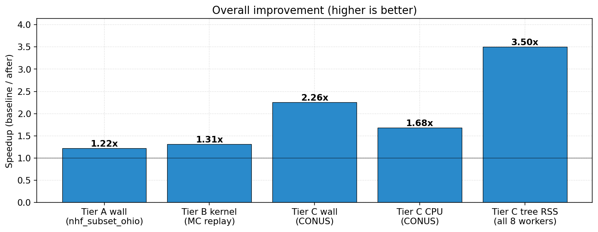

*Figure 1. Speedup of the optimized build on Python 3.11 over the baseline, per tier.*

*Table 4. Speedup split between the code changes and the Python 3.11 upgrade.*

| | Code (baseline to after-py39) | Python 3.11 (after-py39 to after-py311) | Total |
|---|---:|---:|---:|
| Tier C wall | 2.26x | 1.06x | 2.39x |
| Tier A wall | 1.13x | 1.04x | 1.18x |
| Tier B kernel | 1.13x | 1.01x | 1.13x |
| Tier C PSS (memory) | 1.07x | 1.00x | 1.08x |

On the production workload, CONUS wall time fell from 275.8 s to 115.3 s
([Figure 2](#fig-conus-summary)). Worker utilization rose from 1.40 to 2.02 cores' worth of
the eight, and total CPU time fell 1.66x, so the build does less work and spreads it better
across the workers. Routing and network construction carry most of the gain
([Figure 3](#fig-conus-phases)).

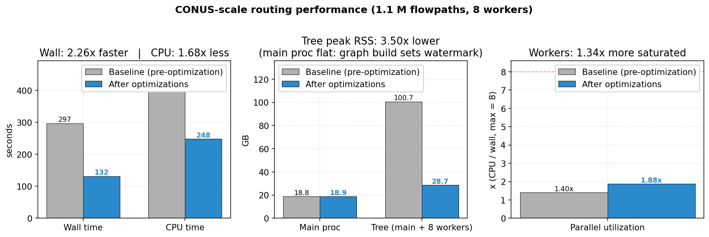

*Figure 2. CONUS wall and CPU time, memory, and parallel utilization, baseline against the
optimized build on Python 3.11 ("this PR" in the legend is [#98]).*

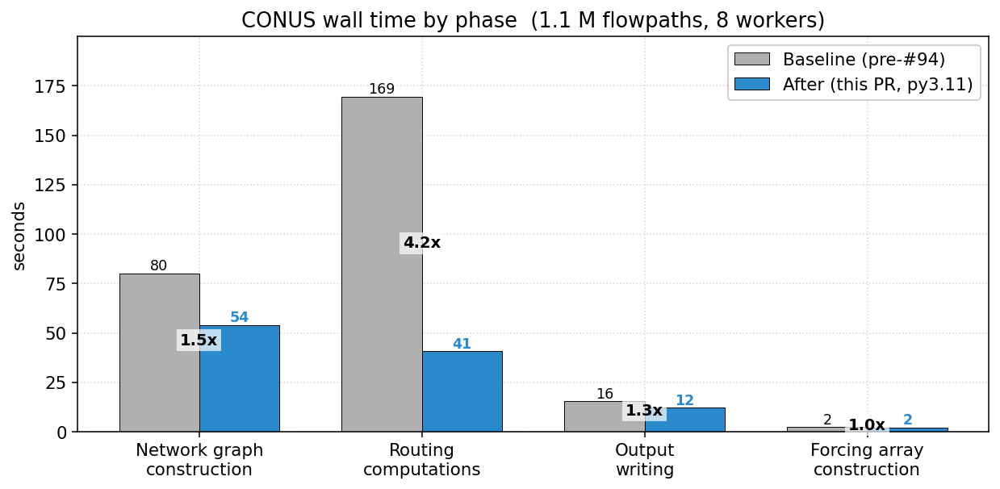

*Figure 3. CONUS wall time by phase. Routing fell from 169.5 s to 40.8 s (4.15x), network
construction from 80.1 s to 54.0 s (1.48x), and output writing from 15.6 s to 12.2 s.*

The single-worker Tier A run, which the kernel dominates, fell from 54.8 s to 46.3 s, and
the isolated kernel replay from 3,161 ms to 2,788 ms ([Figure 4](#fig-tier-a)).

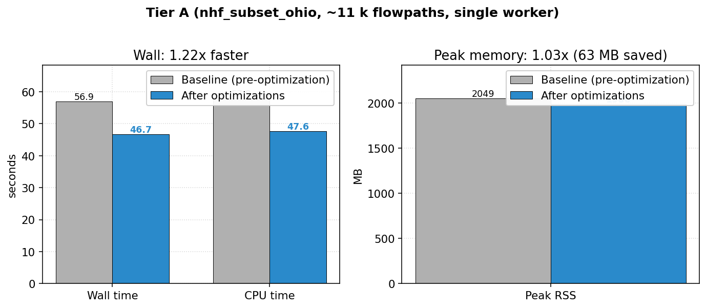

*Figure 4. Tier A wall time, CPU time, and peak memory, same two builds.*

### What changed

1. **Routing-side preparation** (the largest single contributor at CONUS). The main
   process prepared each reach cluster's inputs serially while the eight workers waited.
   A defensive deep copy of the subnetwork list per cluster was removed, six or more
   pandas reindex calls per cluster were collapsed into one positional take per data
   block, 12.2 M membership checks against an empty gage index and 37,510 empty-frame
   allocations were short-circuited, and float32 arrays now reach the workers as views,
   which avoids about 6 GB of copying per CONUS run. [#100] later restructured the compute
   module around an explicit execution plan, typed inputs, and a routing glossary for
   readability and maintenance, and the regression check showed its performance
   unchanged.
2. **Graph construction.** Network construction went from 80.1 s to 54.0 s at CONUS.
   Vectorizing link discretization saved about 17 s, vectorizing the connection extraction
   3 to 4 s, and a numpy group-to-list helper about 7 s.
3. **Fortran kernel and build flags.** The Secant depth solver runs up to 200 times per
   segment call. Its loop-invariant square roots were hoisted into the caller, one `pow`
   was replaced with a multiply, a sum computed three times was cached, the hydraulic
   geometry was split into in-channel and floodplain branches, and the kernel is now
   built with `-O3 -funroll-loops`.
4. **Toolchain.** Python 3.11 added about 6% at CONUS. Replacing `fiona` with `pyogrio`
   dropped a compiled dependency, the image shrank from 1.82 GB to 1.40 GB, and a rebuild
   after a source change takes about 29 s against about 132 s from scratch.

### Memory and correctness

Tree memory at CONUS went from 29.90 GB to 27.79 GB PSS (1.08x). The persistent structures
that `NHF.__init__` builds dominate the footprint, so the CONUS benchmark run needs 28 to 30
GB either way.

Correctness was checked at two levels. The optimized build reproduced its own saved golden
output bit for bit across five Tier A runs. Against the pre-optimization build, over all
11,327 flowpaths and 144 hourly outputs, the largest relative difference in flow was
2.4e-3, within the 1e-2 gate set for a change of compiler flags (the routine regression
check uses 1e-3), the 99th percentile was about 2e-6, and no new NaN or Inf appeared.

### Operational recommendations

`benchmark/RESULTS.md` closes with settings for the operational deployment:
`MALLOC_ARENA_MAX=2` to stop glibc's allocator arenas from inflating memory, BLAS thread
caps of one per worker to avoid 64 threads on 8 cores, CPU and NUMA pinning, and a 32 GB
memory reservation per CONUS cycle. It also sweeps `max_loop_size`, the number of forcing
files loaded per chunk ([Figure 5](#fig-max-loop)).

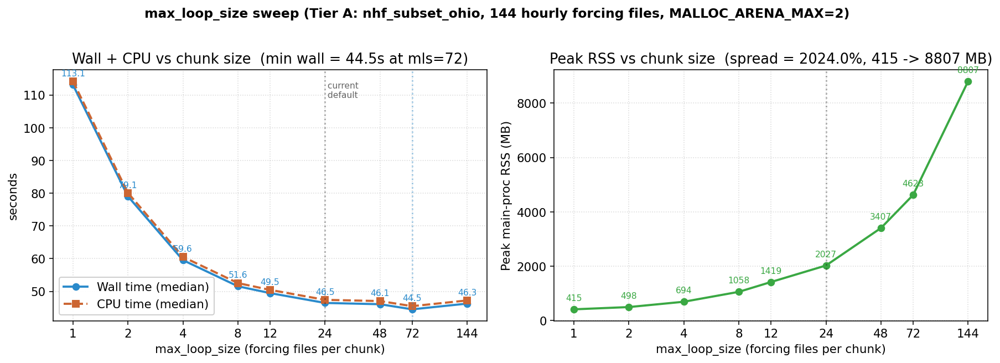

*Figure 5. Tier A wall time and peak memory against `max_loop_size`. Wall time plateaus at 24
(46.5 s, 2,027 MB); loading all 144 files at once uses 8,807 MB for no gain, and 8 halves
peak memory to 1,058 MB for about 11% more wall time.*

### NHF at CONUS scale

The NHF routing path comes from [#86], which discretizes flowpaths into routing links of
consistent, hydraulically appropriate length, distributes lateral inflow following OWP
guidance, and writes the NHF network code to scale to CONUS. NHF 1.2 then replaced small
dense feature ids with hash-derived values near 1e15, and `np.bincount` over divide ids
tried to allocate about 10 PiB. [#104] factorizes the ids and vectorizes the waterbody
lookup, which had scaled as links times waterbodies. With it, the full NHF 1.2 domain
(1,102,154 flowpaths, 8,213 lakes) built in about two minutes and routed to all-finite
output, with 6,362 lakes as level-pool reservoirs. The same pull request fixed a
fresh-checkout build failure under setuptools 70 and a numpy 2 failure in the reservoir
parameter lookup.

## 3. Area-scaled streamflow data assimilation

Streamflow nudging corrects the reach at a gage, and routing carries that correction
downstream. The drainage area above the gage keeps its error, and a forecast initialized
from that state inherits it. Gages are sparse. On VPU 01 (New England) the assimilation
has 84 gages across 24,862 flowpaths.

[#118] implements the simple-scaling scheme of Ogden and Clark (OWP/CIROH R2O Proposal 5,
2025). At each gage, the difference between observed and modeled flow is inserted inside the
routing solve, so it propagates downstream through Muskingum-Cunge in the same timestep.
Upstream, the difference is distributed over the gage's tree, within 200 km, in proportion
to drainage area raised to a power (0.77 by default) and split at confluences by modeled
flow. Each tree stops at the next assimilated gage or waterbody, so no reach is corrected
twice. The upstream correction rewrites each window's published discharge and enters the
routed state once, at the hand-off from analysis to forecast.
[Figure 6](#fig-scaling-method) sketches the scheme.

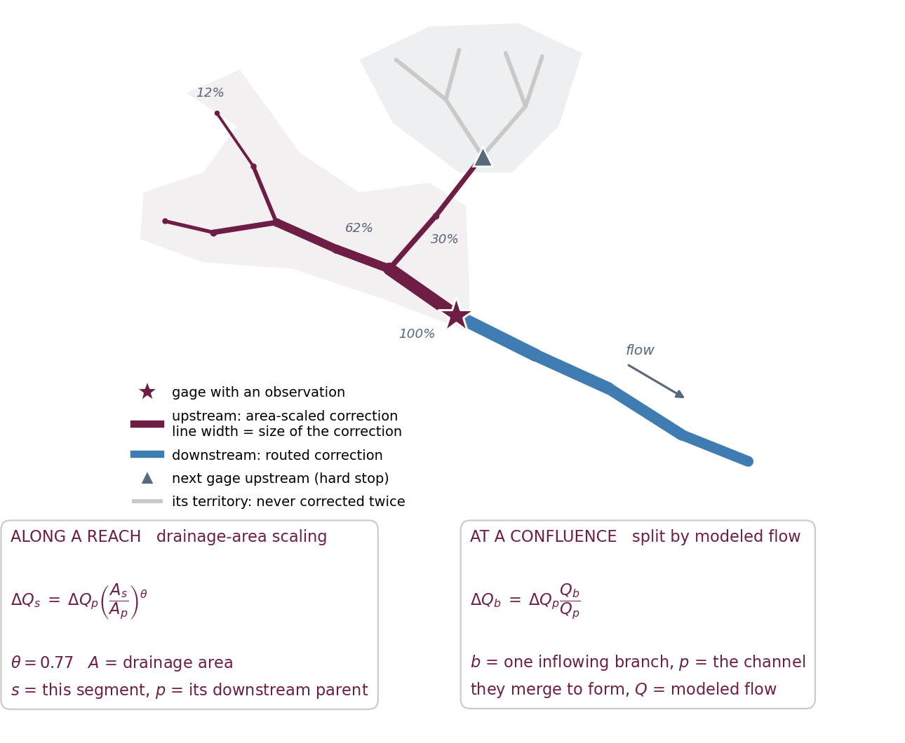

*Figure 6. Upstream reaches receive a correction scaled by drainage area (purple),
downstream reaches receive the routed correction (blue), and the next gage upstream is a
hard stop. The confluence split is drawn in its published form; the code bounds it so the
fractions at a confluence never sum to more than one. Percentages are illustrative.*

Four supporting changes target operational runs. Gage trees are built once from static
topology. A compiled kernel applies the correction. Forcing windows are sized from the job's
memory limit. And the observations each window reads do not depend on how the run is split
into windows, so the same run split two ways gives identical flow on both the command line
and the BMI. An optional travel-time lag traces arrival times through the router's own
Courant field. In a known-truth experiment it cut the median timing error of an injected
pulse from 6.00 h to 2.00 h. It is off by default because its 48 h span does not fit the 3
to 28 h lookbacks of the operational configurations.

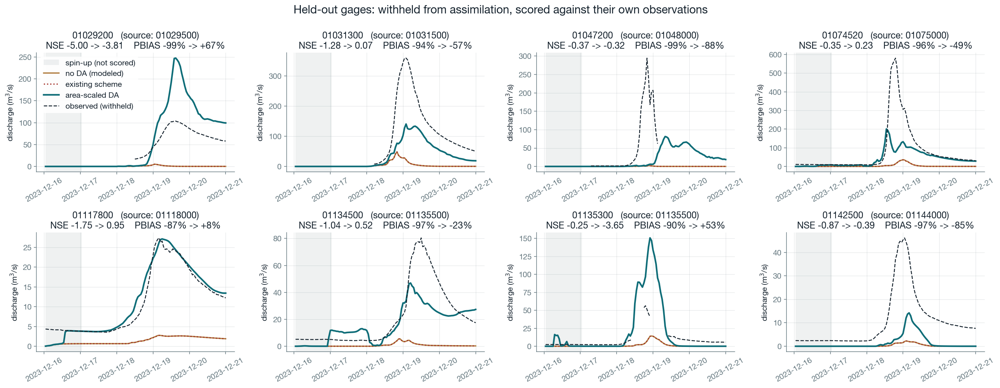

*Figure 7. Eight gages withheld from assimilation on VPU 01 during the December 2023 flood,
scored against their own observations after a one-day spin-up. The existing scheme (dotted)
lies on the no-DA line at every one of them.*

At the eight withheld gages in [Figure 7](#fig-heldout), Nash-Sutcliffe efficiency (NSE)
improves at 7 and absolute percent bias (|PBIAS|) at all 8; the median |PBIAS| falls from
96% to 55%. The lateral inflow in this case runs low (a median of 7.3 L/s/km² against 57 at
the gages), and two gages (01029200 and 01135300) overshoot their observed volume by more
than 50%. On the Ohio subset with retrospective forcing, four withheld gages improve in
median |PBIAS| from 29.6% to 11.5% while median NSE drops from -0.32 to -0.75, so the gain
shows in volume. In a forecast run (24 h of analysis, then 72 h without observations) the
day-1 median |PBIAS| is 45.7% with no DA, 41.2% with nudging, and 32.3% with scaling, and
the three converge by day 3. The new scheme also reaches much more of the network than
nudging ([Figure 8](#fig-reach)).

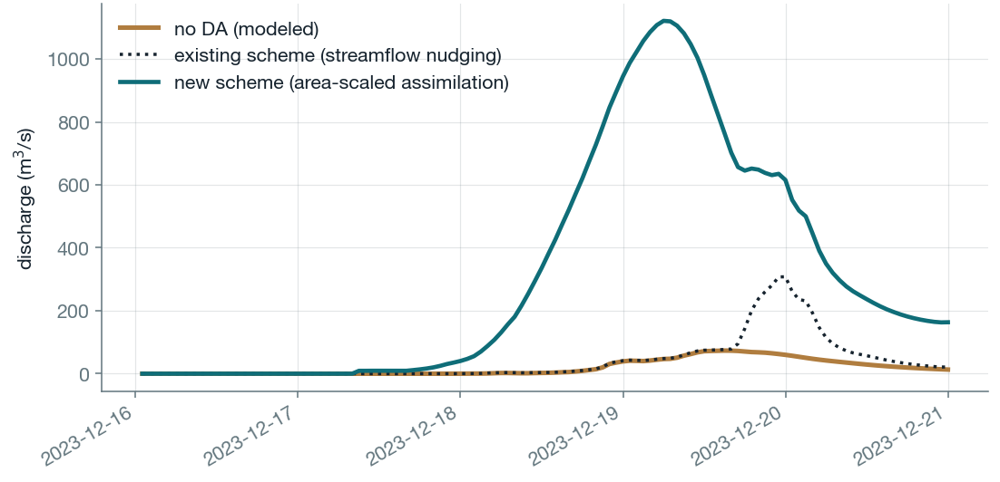

*Figure 8. The ungaged feature on VPU 01 where the two schemes disagree most. Over the whole
domain the new scheme changes 5,098 features and nudging changes 1,706.*

The scheme adds 22.5 s (31.5%) to a 120 h VPU 01 run, against 2.3% for nudging, and the
routing phase takes 61.2 to 62.4 s in every arm. The one CONUS measurement, at
`max_loop_size` 2, put its cost at 4.7x wall time (1,261 s against 270 s). In the Ohio
forecast runs the benefit is confined to the first day.

## 4. Old River water transfer

The Old River Control Structure diverts part of the Mississippi into the Atchafalaya. The
hydrofabric has no channel for it, and the NWM retrospective puts a median of zero at the
outflow channel gage (USGS 07381482) over April to June 2011, where the observed median is
10,364 m³/s. T-Route now represents the structure with observations. At every routing step
the observed diversion leaves a Mississippi donor node and enters an Atchafalaya receiving
node. The transfer, added in [#113] together with streamflow DA on NHF networks, was
extended in [#127].

- **A transfer that matches the observation.** The kernel subtracts the observed diversion
  from the donor, carries the subtracted amount as model state across forcing windows and
  BMI checkpoints, and routes the donor as its own reach, so the reduced flow reaches every
  segment downstream in the same step. An analytic test pins a 1,000 m³/s river with a
  100 m³/s diversion at 900 m³/s. When the donor cannot supply the observation, it floors
  at zero while the receiver still takes the full observation, and the run logs the volume
  added.
- **Persistence when the record stops.** The diversion holds its last observation for
  `diversion_persist_days` (default 11), counted as an absolute deadline from the last
  report. BMI checkpoints carry the held value, and a fresh process with no report in its
  window finds one by scanning the observation files back to the horizon. The production
  configurations use 11 days for analysis and short range, 12 for medium range, and 32 for
  long range, so a report 28 h old at the start still holds at the last hour of the
  forecast.
- **Operational wiring.** The gage is read from the USGS TimeSlice folder on its own,
  independent of streamflow nudging, and the five production configurations carry the
  diversion.

The transfer, its effect at four gages, and the hold when the record stops appear in
[Figure 9](#fig-transfer), [Figure 10](#fig-or-gages), and [Figure 11](#fig-or-persistence).

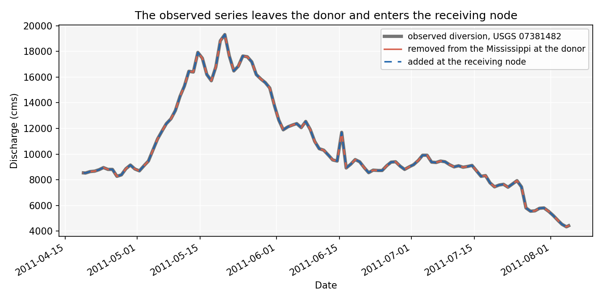

*Figure 9. The amounts removed at the donor and added at the receiver track the observed
diversion. Over 2,567 hours the removed series stays within 0.006 m³/s of the observation.*

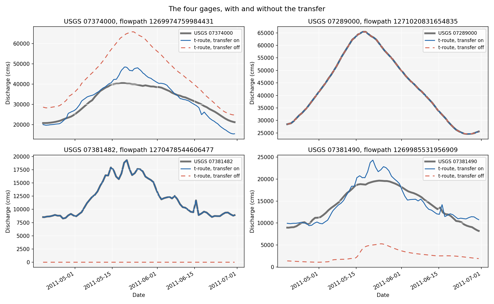

*Figure 10. Four USGS gages with the transfer on and off. Vicksburg (07289000), above the
structure, is identical in both runs. At Baton Rouge (07374000) the peak falls from about
66,000 to about 48,000 m³/s, against about 40,500 observed; at Simmesport (07381490) it
rises from about 5,000 to about 24,000 m³/s, against about 19,600 observed.*

Downstream, Baton Rouge loses 1.007 and Simmesport gains 1.002 of the observed diversion
volume over 2,591 hours. At the flood peak both gages still run above their observations.

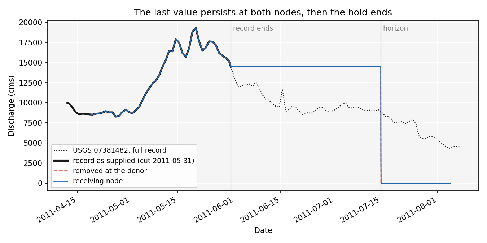

*Figure 11. The record is cut on May 31. Both nodes hold the last value, 14,484 m³/s,
through the 45-day demonstration horizon. At the horizon the donor returns to its routed
flow and the receiving channel drains to under 1% of the held value within two hours.*

The notebook in `test/nhf/old_river/` asserts the transfer, volume, and persistence numbers
above.

## 5. Reservoir routing and reservoir DA

### Level-pool routing and reservoir DA on NHF

[#88] brought level-pool routing to NHF networks from the hydrofabric's lakes layer, and
[#106] extended it to lakes that sit only on virtual flowpaths. [#109] added reservoir DA
on NHF. Each lake in the hydrofabric's `reservoir_da` layer assimilates USGS, USACE, or
USBR observations or follows RFC forecasts, keyed by `nhf_lake_id`.

### Every waterbody routed

When one lake drained directly into another, the reach split grouped them and the second
lake was never routed, so everything below it received zero inflow. NHF 1.2.2 has 213 such
pairs. [#123] splits the network at every waterbody and makes the kernel raise when it
builds fewer reaches than it was given. The same pull request stopped publishing reservoir
water-surface elevation as depth, which had affected 13% of routed features on VPU 01; one
lake at 693 m elevation appeared as a 693 m deep channel.

### Run-of-river dams

Low-head dams hold almost no storage, yet the level pool treats every dam as a reservoir.
[#129] reads the hydrofabric's `run_of_river` flag. On the current CONUS hydrofabric 217
dams carry it. The 207 low-head dams among them now route as channel. The other 10, on the
Columbia, Snake, and Ohio, stay reservoirs because RFCs issue forecasts for them. While no
forecast controls such a dam, it releases its inflow and holds its level.
[Figure 12](#fig-raritan) shows the level pool at low-head dams, and [Figure 13](#fig-snake)
the pass-through at Lower Granite.

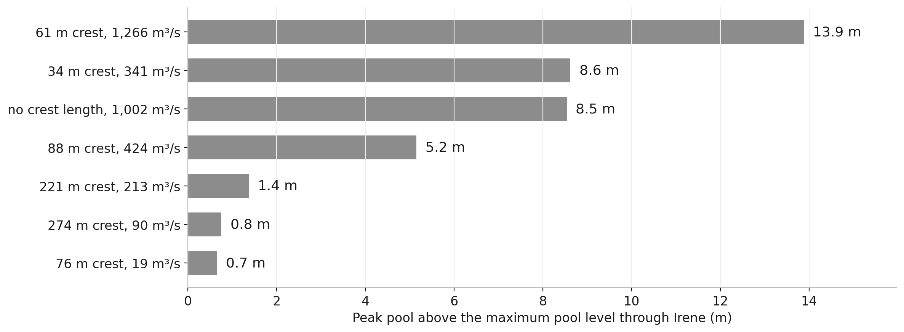

*Figure 12. Routed as level pools, the seven flagged dams in the Raritan basin rise up to
13.9 m above their maximum pool level to pass Hurricane Irene. Routed as channel, the basin
outlet peak changes by 3.3% and the two scored gages tie.*

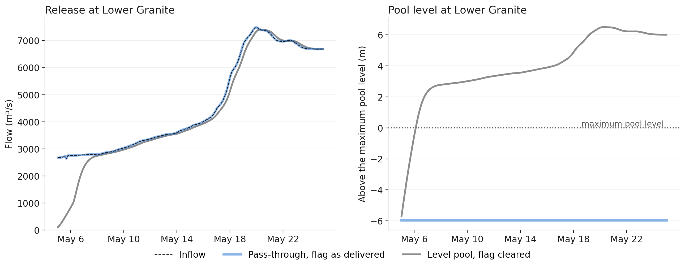

*Figure 13. Lower Granite on the Snake River, May 2011, with RFC DA off. The pass-through
release equals the inflow and the level holds at its cold-start value, the orifice invert.
Routed as a full level pool, the dam first released 107 m³/s against an inflow of 2,669
m³/s, stayed under half its inflow for 33 hours, and rose up to 6.5 m above its maximum
pool.*

### Level pool numerics and dam geometry

- A pool small relative to its outflow moved meters in one step, went NaN, and published
  zero flow while the run exited 0. With all twelve Raritan waterbodies as level pools,
  the outlet received 39.8% of the forcing water. The level pool is now sub-stepped,
  bounded by storage, and conserving, and the same run delivers 92.8%, against 92.9% with
  the seven low-head dams routed as channel.
- The pool elevation was carried in single precision, so a storage change below half a
  unit in the last place rounded away every step, which left a 15 m³/s dead band on
  a 301.7 km² VPU 01 lake. It is now carried in double precision.
- The weir and overtopping crest now come from the National Inventory of Dams (NID) crest
  length and spillway width, with the previous defaults where NID has no value; 1,504 of
  the 6,926 reservoirs routed on CONUS carry a crest length.

### Reservoir DA for operational cycling

- The RFC forecast horizon was measured from the start of the run and re-armed every forcing
  window, so `reservoir_rfc_forecast_persist_days` did nothing in a chunked run. [#126]
  measures it as an absolute deadline from the forecast's issue time
  ([Figure 14](#fig-rfc-horizon)) and gives every unusable forecast one policy,
  `reservoir_rfc_forecasts_unavailable_action`. [#129] sets its default to `level_pool`, so
  a missing forecast degrades that reservoir and the hourly cycle continues.

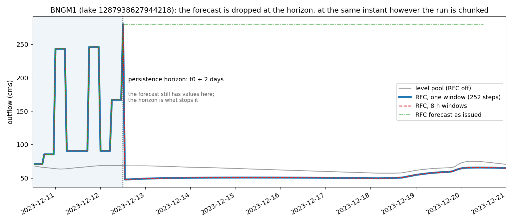

*Figure 14. A reservoir follows its RFC forecast until the horizon, t0 plus 2 days in
this case, and drops it at the same instant whether the run is one window or 8 h windows.
Across 252 hourly outputs and 1,022 waterbodies the two runs differ by zero.*

- Reservoir DA read a zero release as a missing observation. Peaking hydropower dams report
  zero whenever the turbines are off (74% of reports at Dardanelle), so the persistence DA
  held the last nonzero release through those hours. In a run started from in-range pool
  levels, Dardanelle released 511 m³/s against a recorded 156, and the downstream Murray
  gage read 272% high in volume; with zeros kept, Murray reads 37% high
  ([Figure 15](#fig-zero-release)).

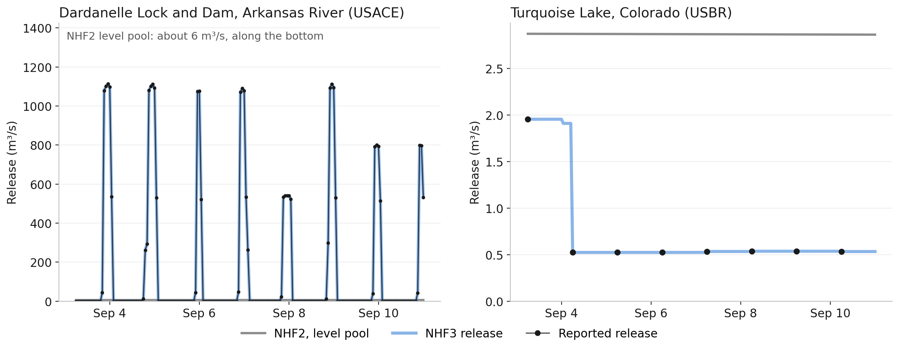

*Figure 15. With zeros kept, the assimilated release at Dardanelle follows the reported
on-off pattern; Turquoise Lake, a USBR site, follows its reported release. Gray lines are
the same dams routed as level pools without DA.*

- Restart files now carry a fingerprint of the network they were written for. Without it,
  a checkpoint written with run-of-river dams flagged, loaded into a run without them,
  handed 508 of 1,018 VPU 01 lakes another lake's state with no error.

## 6. NextGen integration

NextGen drives t-route through its BMI one cycle at a time and carries state between
cycles with `create_state` and `load_state`. Changes were checked on that path in close
collaboration with the NextGen team, across retrospective runs, hourly analysis cycles, and
forecast cycles, as well as on the command line.

- **The same answer through either entry point.** On VPU 01, driving the BMI with the
  lateral flows NextGen delivered gives the command-line result at all 24,862 features over
  120 hours (differences of 0.00 m³/s), and a run restarted from saved state matches the
  continuous run. With the Old River transfer active, a BMI run split into windows is
  bit-identical to the command-line run over 2,772 hours.
- **State that survives a cycle.** A BMI checkpoint carries the data assimilation state
  the next cycle needs: the diversion's held observation and applied subtraction, the RFC
  forecast selection, the observation history behind the nudging decay, and the scaling
  DA's traced travel time together with the network identity it was measured on.
- **The right network, or a clear stop.** Lite restarts and BMI checkpoints carry a
  fingerprint of the network they were written for, and loading one onto a different
  network stops with both fingerprints in the message. Routing link and waterbody ids are
  positional, so without the check a state file from another hydrofabric build or
  discretization loads onto the wrong segments. In one NextGen extended-analysis run, a
  checkpoint from an earlier hydrofabric build shifted every generated link id; 18 links
  failed loudly, and about 32,000 others would have taken a neighbor's state without
  error.
- **Windows sized for the job.** Forcing windows are sized from the job's own memory
  limit, read from the scheduler's cgroup, with a memory model measured on two domains,
  and each NextGen update is split into even windows.
- **Inputs and outputs per cycle.** Each run merges and publishes only its own output
  files, the command-line driver writes a lite restart after every window when
  configured, and the DA forcing model that hands observations to t-route under NextGen
  reads USACE and USBR reservoir records into their own frames and starts with RFC or
  streamflow DA switched off.
- **Production configurations as fixtures.** The five deployed configurations sit in
  `test/troute_prod_configs/`, and tests read the settings that decide behavior out of
  those files.

## 7. Bug fixes

Of these commits, 109 are typed as fixes. [Table 5](#tab-fixes) groups them. "Silent" means
the run produced wrong numbers or lost data and still exited 0; the silent counts are
approximate, from a reading of each commit message.

*Table 5. Fix commits by category.*

| Category | Fixes | Silent | Example |
|---|---:|---:|---|
| Routing kernel numerics | 13 | 11 | The kernel read values it had declared output-only, so forward and reverse passes over 46,080 cases disagreed on 8,349; now on none. |
| Routing orchestration | 7 | 2 | Reach splitting did not separate two adjacent lakes, so the second lake was never routed and everything below it received zero inflow (Section 5). |
| Streamflow and diversion DA, observation reading | 31 | 20 | A hard-coded 15-minute token matched no file in an hourly observation folder, so the run logged 1,640 warnings, assimilated nothing, and exited 0. |
| Reservoir DA | 20 | 12 | Zero releases read as missing (Section 5). |
| Hydrofabric compatibility and scale | 11 | 5 | Lake and hydrolocation column names changed between hydrofabric releases, and the lookups returned empty frames without an error. |
| BMI, output, and restarts | 21 | 10 | The `nudge` output wrote the fill value for all 614 gages. |
| Build and CI | 6 | 0 | A fresh checkout failed to build under setuptools 70. |

A silent failure passes any test that only checks that a run completes, so these fixes come
with tests that check the number. Pull requests [#123], [#127], and [#129] state where their
fixes change results.

## 8. Tests, static analysis, CI, and Python 3.12

**Tests.** Development followed a test-driven practice, with new behavior and fixes landing
alongside tests that pin them; for the kernel fixes in [#129], the new tests were confirmed
to fail on the unfixed build. More than 700 test functions were added in 72 new test files,
and the suite now spans the types in [Table 6](#tab-test-types).

*Table 6. Test types in the suite.*

| Type | What it checks | Example |
|---|---|---|
| Unit | One function or class in isolation | Gage-tree construction, network fingerprints, memory-based window sizing |
| Accuracy | Results against an analytic or known answer | `test_diversion_kernel.py` pins a steady diversion at its analytic value; `test_levelpool_small_pool.py` checks that the pool conserves water |
| Behavioral | A physical or operational behavior through the compiled kernel | A pass-through dam releases its inflow; a held observation expires at its horizon; a chunked run equals a continuous one |
| Integration | Full runs on hydrofabric domains | Old River, Lower Snake, run-of-river, Great Lakes, and Lower Colorado |
| Contract | Layouts the kernel reads by position | Restart column order and the waterbody parameter columns |
| Configuration | The five deployed configurations | `test_production_configs.py` |
| Regression | Speed, memory, and output against a baseline build | `benchmark/scripts/regression_check.sh` |

Where a test could pass for the wrong reason, the behavior was broken on purpose to
confirm the test catches it. A single-precision accumulator in the level pool, for
example, loses 3.8% of inflow and fails its test.

**Static analysis.** The project's ruff configuration (all rules, with a short ignore
list) and strict pyright were added and applied to new code by path, with existing
modules left for a separate cleanup. [#118] recorded both at zero errors on every module
it added. A configuration for fortitude, a Fortran linter, was added as well.

**Python 3.12.** The project moved to Python 3.12. The Cython builds were ported off
`distutils`, which Python 3.12 removed, dependency pins were refreshed, and the development
and production container image defaults to 3.12.

**CI.** The workflow that fired only on `master` was replaced with one that builds the
compiled kernels and runs the non-integration tests, including the Lower Colorado
end-to-end cases, on Python 3.12 for every push and pull request to `development`. That
selection stood at 1,037 passing tests when [#129] merged; the 14 integration cases that
passed there need preprocessed hydrofabric data and run outside CI.

## 9. Open items at delivery

1. Lite restarts and BMI checkpoints written before [#129] carry no network fingerprint
   and are refused on NHF networks. Each configuration starts cold once after deployment,
   or regenerates those files; a flowpath-level channel restart, such as a retrospective
   hot start, still loads.
2. The NHF reader requires `run_of_river`, `dam_crest_length_m`, and `spillway_width_m` on
   the lakes layer, `total_da_sqkm` and `vpu_id` on flowpaths, and `fp_id` on gages. NHF
   1.3.2 carries them; a hydrofabric without them fails validation before any rows are
   read.
3. The diversion needs `diversion_persist_days` of USGS TimeSlice files staged in
   `usgs_timeslices_folder`. Its horizons in the production configurations (11 to 32 days)
   are a proposal for the operators to confirm.
4. The area-scaled DA cost 4.7x wall time in its one CONUS measurement (`max_loop_size` 2,
   taken with [#125]); its cost at medium and long range is not measured.
5. The pass-through at run-of-river forecast dams is one reading of "reservoir attributes
   that minimize storage"; confirmation from the Office of Water Prediction is pending.
6. Muskingum-Cunge discharge drops 77.3% as depth crosses bankfull, a discontinuity
   inherited from the NWM channel geometry. The depth search accepts a root on step size
   and checks the residual only to trigger a restart.
7. The benchmark datasets and their golden output were prepared from NHF builds without
   the lake columns in item 2. They need to be rebuilt from NHF 1.3.2 before the suite runs
   against this code.
8. Ruff is unpinned in the development environment. The current release (0.16.9) enforces
   a copyright-header rule on every module in `src/` and a positional-argument limit that
   four new functions exceed, and a later change to `scaling_da_apply.py` left one pyright
   error and two auto-fixable ruff findings.

[#86]: https://github.com/NGWPC/t-route/pull/86
[#88]: https://github.com/NGWPC/t-route/pull/88
[#94]: https://github.com/NGWPC/t-route/pull/94
[#95]: https://github.com/NGWPC/t-route/pull/95
[#98]: https://github.com/NGWPC/t-route/pull/98
[#100]: https://github.com/NGWPC/t-route/pull/100
[#104]: https://github.com/NGWPC/t-route/pull/104
[#106]: https://github.com/NGWPC/t-route/pull/106
[#108]: https://github.com/NGWPC/t-route/pull/108
[#109]: https://github.com/NGWPC/t-route/pull/109
[#113]: https://github.com/NGWPC/t-route/pull/113
[#118]: https://github.com/NGWPC/t-route/pull/118
[#120]: https://github.com/NGWPC/t-route/pull/120
[#123]: https://github.com/NGWPC/t-route/pull/123
[#124]: https://github.com/NGWPC/t-route/pull/124
[#125]: https://github.com/NGWPC/t-route/pull/125
[#126]: https://github.com/NGWPC/t-route/pull/126
[#127]: https://github.com/NGWPC/t-route/pull/127
[#129]: https://github.com/NGWPC/t-route/pull/129
