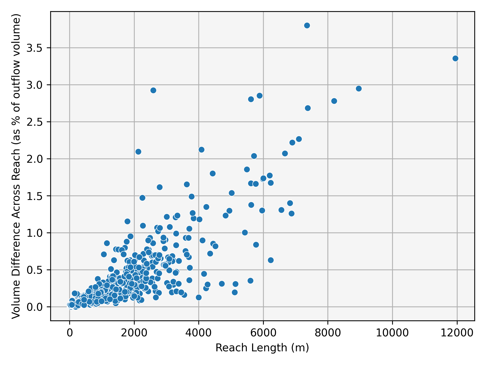
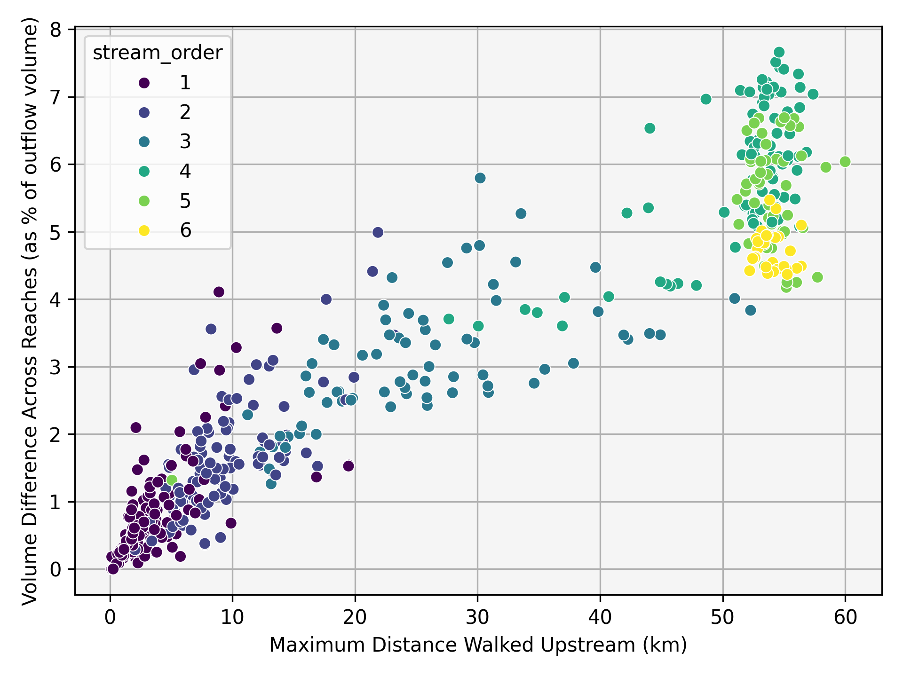
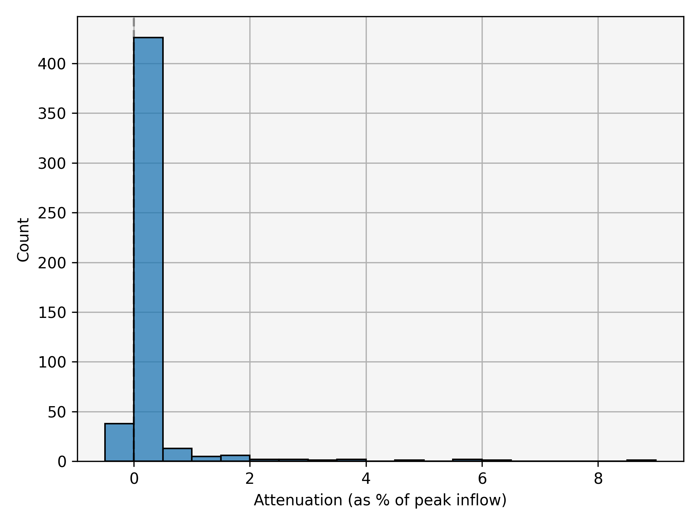

# NHF Tests Overview

Integrating the NHF schema with t-route required several new data-loaders to be defined. To ensure that those loaders were implemented correctly and that no regression occurs as the codebase advances, some new tests were developed. The tests fall into two categories: unit tests and end-to-end tests.

Unit tests are in `test_flow_scaling_utils.py`, `test_flow_scaling.py`, and `test_nhf_utils.py`. These tests are run through the regular pytest interfaces.  For example, to run all tests, you would call `pytest test/nhf`.

End-to-end tests are more open-ended. The `make_forcing.py` script may be used to generate forcing data for NHF (or a subset of NHF) using NWM v3.0 retrospective data. Once forcing data is generated, t-route is run as normal.  `generate_diagnostics.py` may then be used to generate a suite of diagnostic metrics at a random subsample of reaches. `generate_diagnostics.py` may be run on t-route runs not generated with `make_forcing.py`.  For example, diagnostics can be generated for the run described in `test/nhf/conecuh_case/README.md`. The workflow below shows how an end-to-end test can be run for a December 2009 event in the Conecuh River basin.

```consol
cd test/nhf/conecuh_case/

python ../make_forcing.py --start-time "2009-12-12 00:00" --end-time "2009-12-29 00:00" --case-id conecuh_case --hf-file 437343.gpkg --run-id retro

python -m nwm_routing -V5 -f retro.yaml

python ../generate_diagnostics.py conecuh_case/retro.yaml
```

**Note** If you need to subset the hydrofabric from a larger area to a specific watershed, you can use subset_nhf.py.  Example below for Conecuh
```consol
python ../subset_nhf.py --source-gpkg /path/to/big_nhf.gpkg" --out-gpkg domain/437343.gpkg --outlet-fp-id 437343
```

## `make_forcing.py` Details

To make a new forcing dataset, you must start with the NHF (or a subset of the NHF) available. The command line arguments are as follows.

 - start-time: the start time for the simulation
 - end-time: the end time for the simulation
 - case-id: the name of the subdirectory of `test/nhf/` where the run data will be placed
 - hf-file: name of the NHF geopackage.  This file must be in the directory `test/nhf/{case-id}/domain`.
 - run-id: the ID of the run.  There may be multiple events per case that you want to run, and this field allows the events to be distinguished.
 - generate-reference-data: Whether or not to export retrospective data and USGS observed data at any gages in the NHF area.  If true, these data may be used in the `generate_diagnostics.py` to plot at-gage comparisons between the retrospective, observed, and NHF datasets.
 - add-runout-period: If true, an additional one half of the simulation time is added after end-time. In this time window all qlat values are set to zero. This option allows water to move through the network and will generally provide a better estimate of volume conservation.

## Diagnostic Details

To improve efficiency for large datasets, `generate_diagnostics.py` will run on a small sample of reaches within the modeled area. The number of samples is controlled via the --n-samples flag in the CLI call. Those reaches are selected with the following criteria.

### Subset Selection Criteria

- 5% of subset contains **shortest reaches**
- 5% of subset contains **longest reaches**
- 5% of subset contains **steepest reaches**
- 5% of subset contains **shallowest reaches**
- Balance remaining 80% of subset across **stream orders**

---

NB: Graphics below come from a subset of 500 reaches in the conecuh_case example.  Codebase at commit 4b3a98054daafa942fd94bf3de6d4783b207a4ca

### Per-Reach Data Collection

For each reach, record:

- Upstream inflows ($Q_{us}$)
- Lateral inflows ($Q_{lat}$)
- Outflows ($Q_{ds}$)
- Summed lateral inflows from all reaches within a 50 km upstream walk
  - Add upstream inflows to lateral inflows at any non-headwaters 50 km away

Re-route upstream inflows and lateral inflows through the reach to record:

- Celerity
- Courant number
- X values

---

### Diagnostics

---

#### 1. Is Volume Conserved Across a Reach?

To test that the model conserves volume, inflows to a flowpath are compares to the outflows.  The delta Volume metric is defined as,

```math
\Delta V =
\frac{
\sum_{t=0}^{n} \left(Q_{us}(t) + Q_{lat}(t)\right)
-
\sum_{t=0}^{n} Q_{ds}(t)
}{
\sum_{t=0}^{n} Q_{ds}(t)
}
```

Values close to zero are better than large values. The plots for this metric compare volume conservation across river sizes and reach lengths.  Larger rivers and longer reaches are expected to have worse volume conservation, although these two attributes are often confounding. Generally, if volumetric errors are in the single digits, the model is likely conserving volume well. If a runout period is used, values closer to 1% indicate adequate performance.

##### Distribution of Volume Conservation


##### Volume Error vs Reach Length



---

#### 2. Is Volume Conserved Across the Network?

To test that the model conserves water at the network scale, volume is checked by summing qlats along an upstream walk of the network and compared to the outflow hydrograph.

```math
\Delta V =
\frac{
\sum_{t=0}^{n} \sum_{i=1}^{N} Q_{lat,i}(t)
-
\sum_{t=0}^{n} Q_{ds}(t)
}{
\sum_{t=0}^{n} Q_{ds}(t)
}
```

Values close to zero are better than large values. Longer walks are expected to have worse volume conservation. Generally, if volumetric errors are in the single digits, the model is likely conserving volume well. If a runout period is used, values closer to 1% indicate adequate performance.

##### Distance Walked Upstream vs Volume Lost



---

#### 3. Are Negative Outflows Present?

This simple boolean check should always be false for all reaches.  If it is not, something has gone very wrong. Any negative outflow values indicate a fail.  While there is no plot for this diagnostic, it is summarized in the diagnostics.json.

---

#### 4. Are Attenuation and Hydrograph Acceleration Modest?

Attenuation occurs when a hydrograph peak discharge is reduced across the reach, and acceleration occurs when the peak increases.

```math
\text{Attenuation} =
1 -
\frac{
\max(Q_{ds})
}{
\max(Q_{us} + Q_{lat})
}
```

Generally, attenuation values should be modest across any given reach.  Values in the 0-5% range are typical, but some reaches may go up to ~20%.  Higher values may indicate issues in network discretization, run parameters, or routing code implementation.


##### Histogram of Attenuation Values



---

#### 5. Are Courant Numbers Reasonable?

The courant number describes how fast a flood pulse moves across a reach relative to the reach size and timestep.  Values greater than one means that the flood moves more than one reach length per timestep and generally indicate poor routing performance.

```math
{C}_{n} =
\frac{
{C}_{k}*dx
}{
dt
}
```

##### KDE of Minimum and Maximum Courant Numbers


---

#### 6. Is Lag Proportional to Celerity?

Lag is generally defined as the time from inflow peak t outflow peak. Given that many natural events do not follow the archetypal shape of the unit hydrograph, robust methods for automating lag detection are challenging.  In this metric, lag is calculated as the hydrograph center of mass, and the difference in center of mass between inflow and outflow is used to define lag.  This value is then normalized by length to get an approximate flood pulse translation rate.

```math
t_c = \frac{\sum_{t=0}^{n} t \, Q(t)}{\sum_{t=0}^{n} Q(t)}
```
```math
\Delta t_c = t_{c,ds} - t_{c,us}
```
```math
\text{hydrograph\_translation\_rate}
=
\frac{\Delta x}{\Delta t_c}
```

The flood translation rate is the realization of reach celerity, so it should generally be proportional to the average celerity over the hydrogaph.

##### Celerity vs Centroid Shift Rate


---

#### 7. How Appropriate Are Reach Lengths?

The combination of reach length and timestep can completely change the results of a Muskingum-Cunge simulation. The "correct" combination has a long history of debate in the scientific literature.  One approach to reach length determination was proposed by Ponce and Theurer in 1982.  It is described below.

ref: V. M. Ponce and F. D. Theurer, “Accuracy Criteria in Diffusion Routing,” Journal of Hydraulics Division, Proceedings of the American Society of Civil Engineers, Vol. 108, No. 6, 1982, pp. 747-757

```math
q_{\text{ref}} = \frac{\max(Q_{in}) + \min(Q_{in})}{2}
```

Let $t^*$ be the index minimizing $|Q_{in}(t) - q_{\text{ref}}|$.

Get reference hydraulic geometry and parameters.

```math
q_{\text{ref}}^{*} = Q_{out}(t^*)
```

```math
c_{\text{ref}} = c(t^*)
```

```math
T_{w,\text{ref}} = T_w(t^*)
```

Calculate ponce optimal dx


```math
\Delta x_{courant} = \Delta t \, c_{\text{ref}}
```

```math
\Delta x_{characteristic} =
\frac{q_{\text{ref}}^{*} / T_{w,\text{ref}}}
{S_0 \, c_{\text{ref}}}
```

```math
\Delta x_{\max} = \frac{1}{2} \left( \Delta x_{courant} + \Delta x_{characteristic} \right)
```

Let

```math
c_{\max} = \max(c)
```

```math
\Delta x_{\min} = c_{\max} \, \Delta t
```

The ideal reach length is

```math
\Delta x_{\text{ideal}} = \max(\Delta x_{\min}, \Delta x_{\max})
```

Finally,

```math
\text{dx\_ratio} = \frac{\Delta x}{\Delta x_{\text{ideal}}}
```

The histogram of this ratio can be used to determine how well the NHF discretization length worked for a given simulation.

##### Histogram + eCDF of $dx$ / Ponce-Optimal Reach Length


## Running the CONUS case

To run t-route on NHF at the CONUS scale, use the example workflow below. This test runs t-route for a portion of the 2022 US summer floods over all of CONUS.

```console
cd test/nhf/conus
mkdir domain
ln -s /path/to/your/nhf.gpkg domain/nhf.gpkg
python ../make_forcing.py --start-time "2022-07-25 00:00" --end-time "2022-07-26 12:00" --case-id conus --hf-file nhf.gpkg --run-id retro
python -m nwm_routing -V5 -f retro.yaml
python ../generate_diagnostics.py --file retro.yaml 
```
