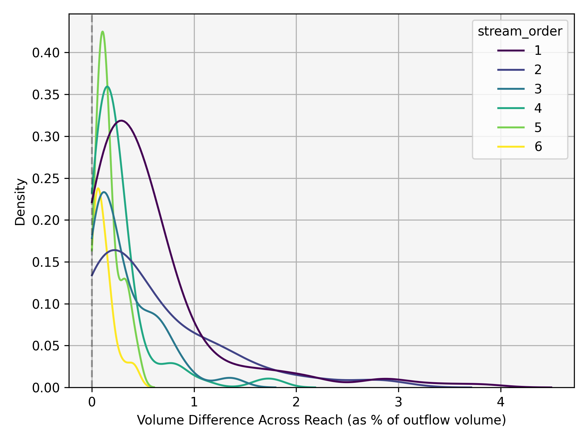
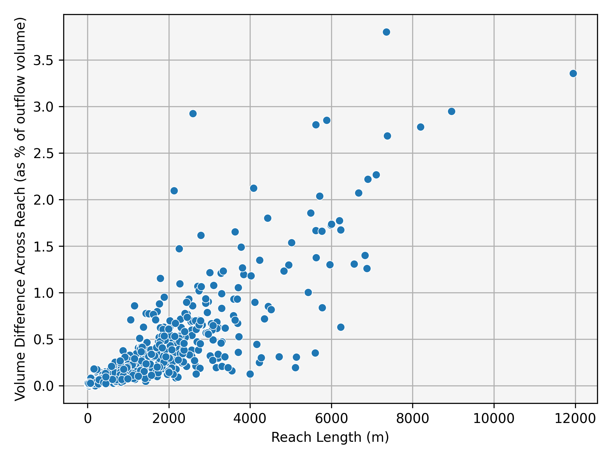
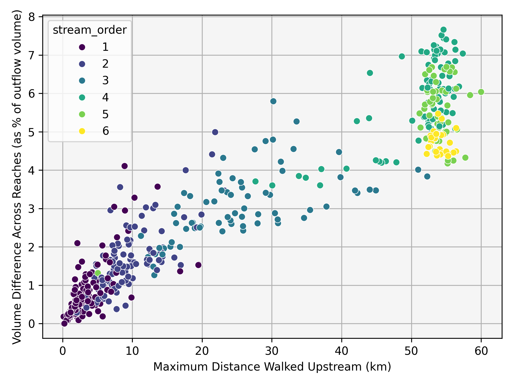
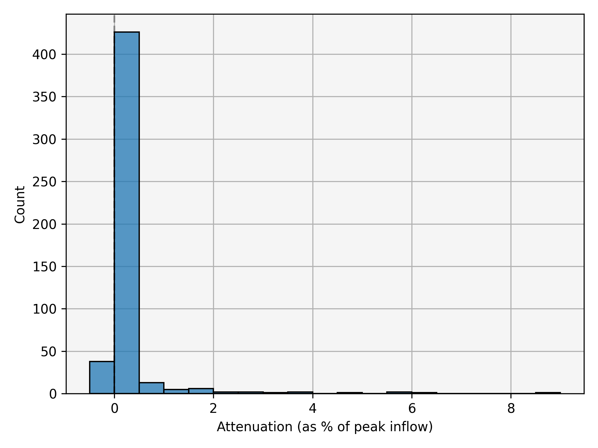
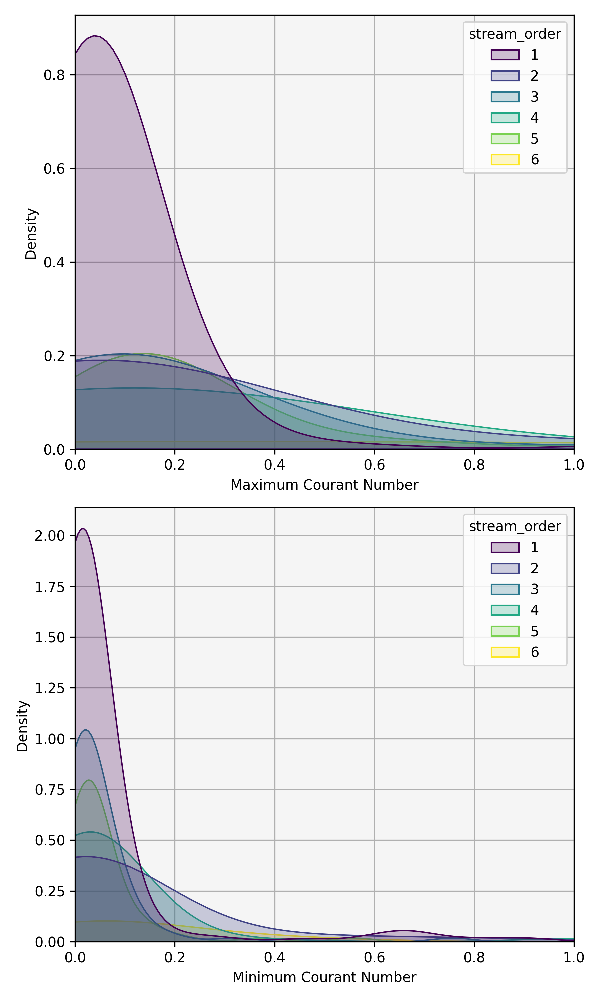
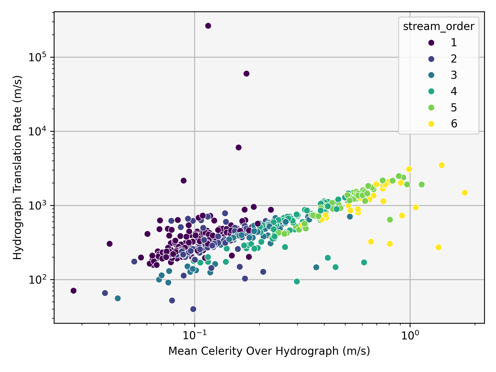
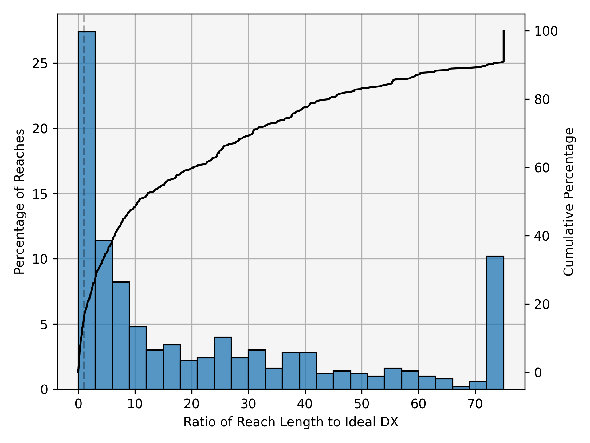

# NHF Tests

Tests for the NHF (National Hydrofabric) routing implementation and the t-route V5 CLI.

- **Integration tests** — full model runs, marked `integration` for pytest. Each test checks whether its input data exists and skips if not. Run `prep_tests.py` first.
- **Unit tests** — currently broken, see below.
- **Diagnostic suite** — standalone scripts for plotting and metrics. Not collected by pytest.

BMI execution (`run_bmi.py`) is currently broken.

---

## Quick Start

### 1 — Build test data

```console
# All tests (NHF geopackage required for network-derived cases)
python test/nhf/prep_tests.py --nhf-gpkg /path/to/nhf.gpkg

# Specific tests only
python test/nhf/prep_tests.py --nhf-gpkg /path/to/nhf.gpkg --test conecuh patuxent

# Re-generate existing data
python test/nhf/prep_tests.py --nhf-gpkg /path/to/nhf.gpkg --refresh
```

### 2 — Run tests

```console
# All tests (unit + integration)
pytest test/nhf

# Integration tests only
pytest -m integration

# Unit tests only
pytest -m "not integration" test/nhf
```

---

## Integration Tests

Each test runs t-route end-to-end and checks model output.  If the input data is missing the test is skipped — run `prep_tests.py` first.

### Conecuh River (`conecuh_case`)

NHF routing on a well-observed Alabama basin (USGS gage 02374250), December 2009 flood.

| Parameter | Value |
|---|---|
| Outlet fp_id | `1270581653591645` |
| Period | 2009-12-12 to 2009-12-29 |
| Forcing | `retro` (NWM v3 retrospective) |
| Lat / Lon | 31.06503,-87.06368 |

---

### Patuxent Reservoir (`patuxent`)

Simple, well-gauged site for checking level-pool reservoir behaviour.

| Parameter | Value |
|---|---|
| Outlet fp_id | `1284196257037837` |
| Period | 2011-09-05 to 2011-09-15 |
| Forcing | `retro` |
| Lat / Lon | 38.91812,-76.68369 |

---

### Lake Creek (`lake_creek`)

Two lakes on the same flowpath. Tests in-series reservoir routing. A gage is present; results should improve once water-level hot starts are in.

| Parameter | Value |
|---|---|
| Outlet fp_id | `1266641284404728` |
| Period | 1987-03-20 to 1987-03-30 |
| Forcing | `retro` |
| Lat / Lon | 43.11703,-101.73266 |

---

### Hot Brook (`hot_brook`)

Small synthetic domain with two in-series lakes. Used for iterating on level-pool logic without the overhead of retrospective data. `review.py` regenerates the diagnostic plot after routing.

| Parameter | Value |
|---|---|
| Outlet fp_id | `1288003930934961` |
| Period | 2000-01-01 to 2000-01-03 |
| Forcing | `pulse` (synthetic unit hydrograph) |
| Lat / Lon | 45.60821,-67.93942 |

---

### Great Lakes (`great_lakes`)

DA-forced outflows from the three fp_id-bearing Great Lakes (Superior, Erie, Ontario via outflow CSV). Checks that forced values propagate correctly downstream. A domain is committed to the repo and runs as-is; use `build_domain.py` to regenerate from a newer NHF release.

| Parameter | Value |
|---|---|
| Lake fp_ids | `4800002`, `4800004`, `4800006` |
| Forcing | Zero qlat + DA timeslice files |
| Lat / Lon | 46.24721,-69.55897 |

---

### Four Lakes — Reservoir DA (`four_lakes`)

Runs all four reservoir DA types in one shot: USGS persistence (type 2), USACE persistence (type 3), RFC time-series (type 4), USBR persistence (type 7). `prep_tests.py` generates synthetic constant-flow DA files. The test checks that the immediately-downstream reach of each reservoir carries the expected outflow.

| Parameter | Value |
|---|---|
| Outlet fp_id | `1276182780176988` |
| Period | 2020-01-01 00:00 to 01:00 |
| Forcing | Constant qlat + synthetic DA files |
| Lat / Lon | 42.90326,-89.21309 |

---

## Unit Tests

| File | Coverage |
|---|---|
| `test_flow_scaling.py` | Catchment discharge distribution to NHF links |
| `test_flow_scaling_utils.py` | Flow scaling utility functions |
| `test_nhf_utils.py` | NHF geometry and network utilities |

**These are currently broken.** `distribute_catchment_discharge` was removed from `troute.nhf_discretize` and the tests were not updated. `test_flow_scaling.py` will fail at import until this is fixed.

---

## Diagnostic Suite

`generate_diagnostics.py` computes a standard set of hydraulic metrics for any completed run. It exists because raw NetCDF output is hard to QC — routing bugs often produce reasonable-looking hydrographs while quietly violating volume conservation or generating bad Courant numbers.

```console
python test/nhf/generate_diagnostics.py -f /path/to/run.yaml
python test/nhf/generate_diagnostics.py -f /path/to/run.yaml --n-samples 500
```

See [Diagnostic Suite Specifics](#diagnostic-suite-specifics) for metric details.

---

# CLI Reference

## `prep_tests.py`

Builds test input data without running the tests. Skips existing outputs unless `--refresh` is passed.

```
python test/nhf/prep_tests.py [OPTIONS]

Options:
  --nhf-gpkg PATH        NHF geopackage path. Required for: conecuh,
                         patuxent, lake_creek, great_lakes, four_lakes.
  --test NAME [NAME ...] Which tests to prep. Default: all.
                         Choices: conecuh patuxent lake_creek great_lakes
                                  ciss_creek hot_brook four_lakes
  --refresh              Regenerate even if outputs already exist.
```

## `subset_nhf.py`

Pulls all NHF components upstream of an outlet flowpath into a new geopackage. Called by `prep_tests.py` automatically.

```
python test/nhf/subset_nhf.py [OPTIONS]

Options:
  --source-gpkg PATH     Source NHF geopackage.
  --out-gpkg PATH        Output geopackage path.
  --outlet-fp-id INT     fp_id of the outlet flowpath.
```

## `make_forcing.py`

Writes per-timestep lateral inflow CSVs and a t-route config YAML for a given case.

```
python test/nhf/make_forcing.py [OPTIONS]

Options:
  --case-id STR          Case directory name.
  --hf-file STR          Hydrofabric filename inside domain/.
  --run-id STR           Run identifier (default: retro).
  --start-time STR       Simulation start (e.g. "2009-12-12 00:00").
  --end-time STR         Simulation end.
  --forcing-mode MODE    retro | pulse | constant  (default: retro)
  --peak-qlat FLOAT      Peak discharge m3/s for pulse mode (default: 10000).
  --constant-qlat FLOAT  Constant qlat m3/s for constant mode (default: 1.0).
  --generate-reference-data  Export retrospective + USGS gage data alongside forcing.
  --no-runout-period     Skip the zero-qlat runout window added after end-time by default.
```

| Mode | Description |
|---|---|
| `retro` | Hourly lateral inflows from the NWM v3.0 retrospective Zarr on S3. Requires a `reference_flowpaths` layer in the gpkg. |
| `pulse` | Synthetic unit-hydrograph pulse scaled to `--peak-qlat`, applied uniformly to all reaches. Shape is resampled to fit `[start-time, end-time]`. |
| `constant` | Flat `--constant-qlat` on every reach for every timestep. |

---

# Diagnostic Suite Specifics

`generate_diagnostics.py` runs on a random sample of reaches for efficiency. Sample size is set with `--n-samples`. Reaches are drawn as follows:

- 5% shortest reaches
- 5% longest reaches
- 5% steepest reaches
- 5% shallowest reaches
- remaining 80% distributed across stream orders

NB: example graphics below are from a 500-reach sample of the conecuh_case run at commit 4b3a98054daafa942fd94bf3de6d4783b207a4ca.

### Per-Reach Data Collection

- Upstream inflows ($Q_{us}$)
- Lateral inflows ($Q_{lat}$)
- Outflows ($Q_{ds}$)
- Summed lateral inflows from all reaches within a 50 km upstream walk
  - Add upstream inflows to lateral inflows at any non-headwaters 50 km away

Re-route upstream inflows and lateral inflows through the reach to record:

- Celerity
- Courant number
- X values

---

### Diagnostics

---

#### 1. Is Volume Conserved Across a Reach?

To test that the model conserves volume, inflows to a flowpath are compares to the outflows.  The delta Volume metric is defined as,

```math
\Delta V =
\frac{
\sum_{t=0}^{n} \left(Q_{us}(t) + Q_{lat}(t)\right)
-
\sum_{t=0}^{n} Q_{ds}(t)
}{
\sum_{t=0}^{n} Q_{ds}(t)
}
```

Values close to zero are better than large values. The plots for this metric compare volume conservation across river sizes and reach lengths.  Larger rivers and longer reaches are expected to have worse volume conservation, although these two attributes are often confounding. Generally, if volumetric errors are in the single digits, the model is likely conserving volume well. If a runout period is used, values closer to 1% indicate adequate performance.

##### Distribution of Volume Conservation



##### Volume Error vs Reach Length



---

#### 2. Is Volume Conserved Across the Network?

To test that the model conserves water at the network scale, volume is checked by summing qlats along an upstream walk of the network and compared to the outflow hydrograph.

```math
\Delta V =
\frac{
\sum_{t=0}^{n} \sum_{i=1}^{N} Q_{lat,i}(t)
-
\sum_{t=0}^{n} Q_{ds}(t)
}{
\sum_{t=0}^{n} Q_{ds}(t)
}
```

Values close to zero are better than large values. Longer walks are expected to have worse volume conservation. Generally, if volumetric errors are in the single digits, the model is likely conserving volume well. If a runout period is used, values closer to 1% indicate adequate performance.

##### Distance Walked Upstream vs Volume Lost



---

#### 3. Are Negative Outflows Present?

This simple boolean check should always be false for all reaches.  If it is not, something has gone very wrong. Any negative outflow values indicate a fail.  While there is no plot for this diagnostic, it is summarized in the diagnostics.json.

---

#### 4. Are Attenuation and Hydrograph Acceleration Modest?

Attenuation occurs when a hydrograph peak discharge is reduced across the reach, and acceleration occurs when the peak increases.

```math
\text{Attenuation} =
1 -
\frac{
\max(Q_{ds})
}{
\max(Q_{us} + Q_{lat})
}
```

Generally, attenuation values should be modest across any given reach.  Values in the 0-5% range are typical, but some reaches may go up to ~20%.  Higher values may indicate issues in network discretization, run parameters, or routing code implementation.


##### Histogram of Attenuation Values



---

#### 5. Are Courant Numbers Reasonable?

The courant number describes how fast a flood pulse moves across a reach relative to the reach size and timestep.  Values greater than one means that the flood moves more than one reach length per timestep and generally indicate poor routing performance.

```math
{C}_{n} =
\frac{
{C}_{k}*dx
}{
dt
}
```

##### KDE of Minimum and Maximum Courant Numbers



---

#### 6. Is Lag Proportional to Celerity?

Lag is generally defined as the time from inflow peak t outflow peak. Given that many natural events do not follow the archetypal shape of the unit hydrograph, robust methods for automating lag detection are challenging.  In this metric, lag is calculated as the hydrograph center of mass, and the difference in center of mass between inflow and outflow is used to define lag.  This value is then normalized by length to get an approximate flood pulse translation rate.

```math
t_c = \frac{\sum_{t=0}^{n} t \, Q(t)}{\sum_{t=0}^{n} Q(t)}
```
```math
\Delta t_c = t_{c,ds} - t_{c,us}
```
```math
\text{hydrograph\_translation\_rate}
=
\frac{\Delta x}{\Delta t_c}
```

The flood translation rate is the realization of reach celerity, so it should generally be proportional to the average celerity over the hydrogaph.

##### Celerity vs Centroid Shift Rate



---

#### 7. How Appropriate Are Reach Lengths?

The combination of reach length and timestep can completely change the results of a Muskingum-Cunge simulation. The "correct" combination has a long history of debate in the scientific literature.  One approach to reach length determination was proposed by Ponce and Theurer in 1982.  It is described below.

ref: V. M. Ponce and F. D. Theurer, “Accuracy Criteria in Diffusion Routing,” Journal of Hydraulics Division, Proceedings of the American Society of Civil Engineers, Vol. 108, No. 6, 1982, pp. 747-757

```math
q_{\text{ref}} = \frac{\max(Q_{in}) + \min(Q_{in})}{2}
```

Let $t^*$ be the index minimizing $|Q_{in}(t) - q_{\text{ref}}|$.

Get reference hydraulic geometry and parameters.

```math
q_{\text{ref}}^{*} = Q_{out}(t^*)
```

```math
c_{\text{ref}} = c(t^*)
```

```math
T_{w,\text{ref}} = T_w(t^*)
```

Calculate ponce optimal dx


```math
\Delta x_{courant} = \Delta t \, c_{\text{ref}}
```

```math
\Delta x_{characteristic} =
\frac{q_{\text{ref}}^{*} / T_{w,\text{ref}}}
{S_0 \, c_{\text{ref}}}
```

```math
\Delta x_{\max} = \frac{1}{2} \left( \Delta x_{courant} + \Delta x_{characteristic} \right)
```

Let

```math
c_{\max} = \max(c)
```

```math
\Delta x_{\min} = c_{\max} \, \Delta t
```

The ideal reach length is

```math
\Delta x_{\text{ideal}} = \max(\Delta x_{\min}, \Delta x_{\max})
```

Finally,

```math
\text{dx\_ratio} = \frac{\Delta x}{\Delta x_{\text{ideal}}}
```

The histogram of this ratio can be used to determine how well the NHF discretization length worked for a given simulation.

##### Histogram + eCDF of $dx$ / Ponce-Optimal Reach Length

