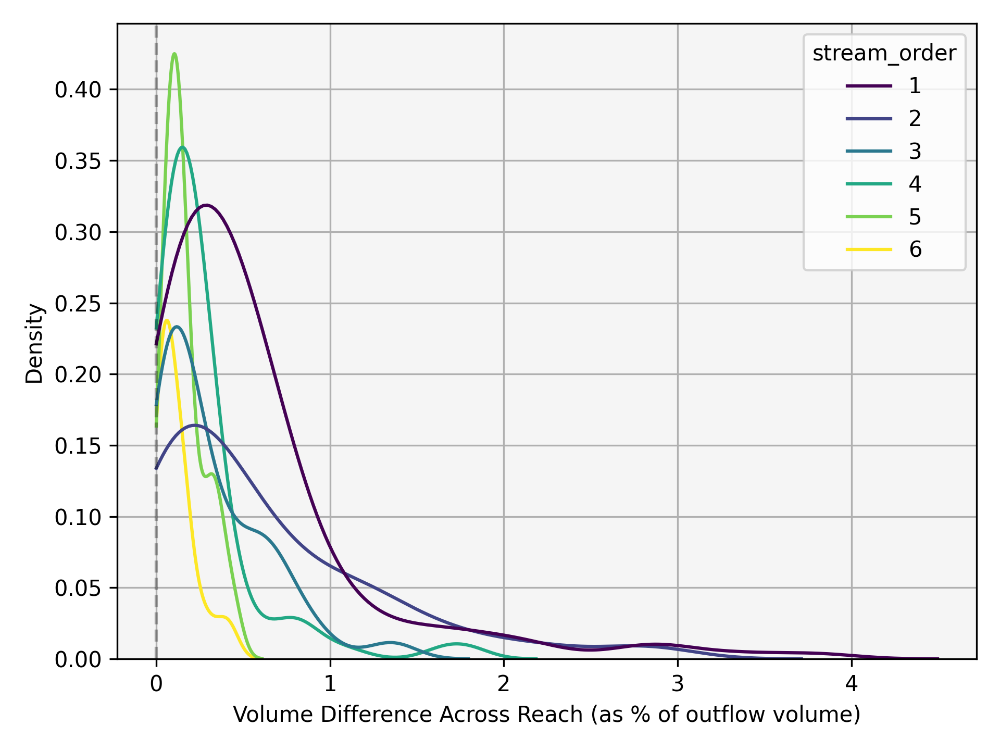
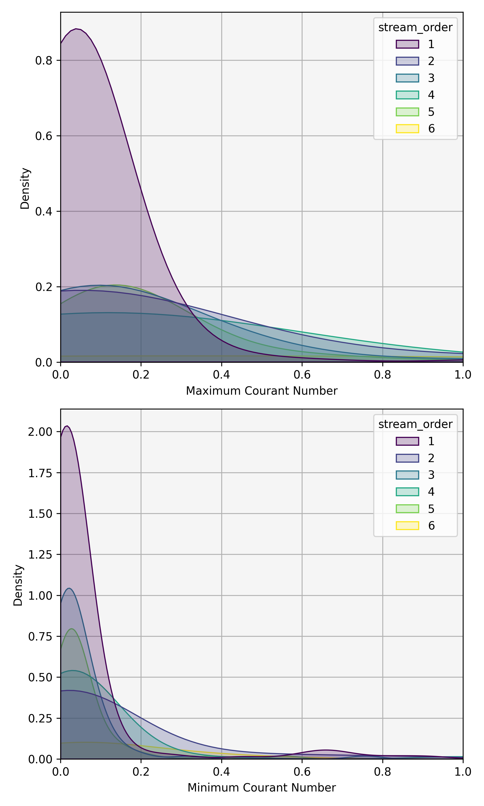
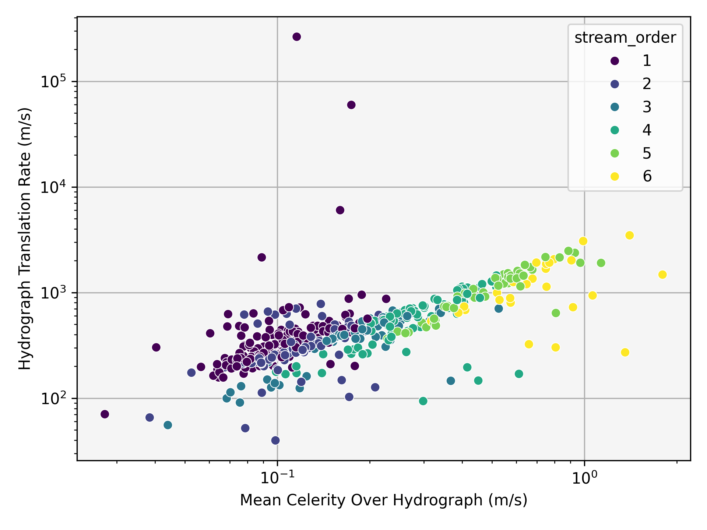
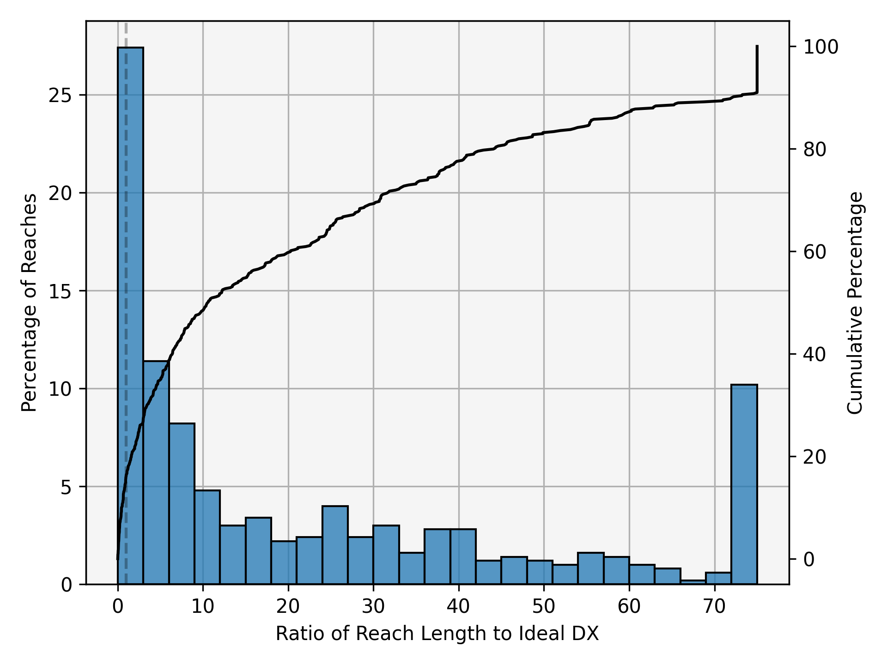

# T-route Diagnostic Plots

## Testing Protocol

1. Run **t-route** for an event of interest on a network of interest.
2. Select a subset of reaches (not all reaches due to computational limitations).
3. Only review reaches with nonzero outflow for all timesteps.

### Subset Selection Criteria

- 5% of subset contains **shortest reaches**
- 5% of subset contains **longest reaches**
- 5% of subset contains **steepest reaches**
- 5% of subset contains **shallowest reaches**
- Balance remaining 80% of subset across **stream orders**

---

NB: Graphics below come from a subset of 500 reaches in the conecuh_case example.  Codebase at commit 4b3a98054daafa942fd94bf3de6d4783b207a4ca

## Per-Reach Data Collection

For each reach, record:

- Upstream inflows ($Q_{us}$)
- Lateral inflows ($Q_{lat}$)
- Outflows ($Q_{ds}$)
- Summed lateral inflows from all reaches within a 50 km upstream walk
  - Add upstream inflows to lateral inflows at any non-headwaters 50 km away

Re-route upstream inflows and lateral inflows through the reach to record:

- Celerity
- Courant number
- X values

---

# Diagnostics

---

## 1. Is Volume Conserved Across a Reach?

### Metric

$$
\Delta V =
\frac{
\sum_{t=0}^{n} \left(Q_{us}(t) + Q_{lat}(t)\right)
-
\sum_{t=0}^{n} Q_{ds}(t)
}{
\sum_{t=0}^{n} Q_{ds}(t)
}
$$

### Test

- Maximum volume difference across sampled reaches < 10%

### Visualizations

#### Distribution of Volume Conservation

#### Volume Error vs Reach Length

---

## 2. Is Volume Conserved Across the Network?

### Metric

$$
\Delta V =
\frac{
\sum_{t=0}^{n} \sum_{i=1}^{N} Q_{lat,i}(t)
-
\sum_{t=0}^{n} Q_{ds}(t)
}{
\sum_{t=0}^{n} Q_{ds}(t)
}
$$

### Test

- No more than 0.5% loss per kilometer

### Visualization

#### Distance Walked Upstream vs Volume Lost

---

## 3. Are Negative Outflows Present?

### Metric

$$
Q_{out}
$$

### Test

- Check if any outflows are less than 0

---

## 4. Are Attenuation and Hydrograph Acceleration Modest?

### Metric

$$
\text{Attenuation} =
1 -
\frac{
\max(Q_{ds})
}{
\max(Q_{us} + Q_{lat})
}
$$

### Test

- Maximum hydrograph acceleration < 5%
- Maximum hydrograph attenuation < 20%

### Visualization

#### Histogram of Attenuation Values

---

## 5. Are Courant Numbers Reasonable?

### Metric

- Maximum or minimum Courant number over the event

### Test

- Less than 25% of reaches with maximum Courant value ≥ 1

### Visualization

#### KDE of Minimum and Maximum Courant Numbers

---

## 6. Is Lag Proportional to Celerity?

### Metric

$$
t_c = \frac{\sum_{t=0}^{n} t \, Q(t)}{\sum_{t=0}^{n} Q(t)}
$$
$$
\Delta t_c = t_{c,ds} - t_{c,us}
$$
$$
\text{hydrograph\_translation\_rate}
=
\frac{\Delta x}{\Delta t_c}
$$

### Visualization

#### Celerity vs Centroid Shift Rate

---

## 7. How Appropriate Are Reach Lengths?

### Metric

$$
q_{\text{ref}} = \frac{\max(Q_{in}) + \min(Q_{in})}{2}
$$

Let $t^*$ be the index minimizing $|Q_{in}(t) - q_{\text{ref}}|$.

Get reference hydraulic geometry and parameters.

$$
q_{\text{ref}}^{*} = Q_{out}(t^*)
$$

$$
c_{\text{ref}} = c(t^*)
$$

$$
T_{w,\text{ref}} = T_w(t^*)
$$

Calculate ponce optimal dx

$$
\Delta x_{courant} = \Delta t \, c_{\text{ref}}
$$

$$
\Delta x_{characteristic} =
\frac{q_{\text{ref}}^{*} / T_{w,\text{ref}}}
{S_0 \, c_{\text{ref}}}
$$

$$
\Delta x_{\max} = \frac{1}{2} \left( \Delta x_{courant} + \Delta x_{characteristic} \right)
$$

Let

$$
c_{\max} = \max(c)
$$

$$
\Delta x_{\min} = c_{\max} \, \Delta t
$$

The ideal reach length is

$$
\Delta x_{\text{ideal}} = \max(\Delta x_{\min}, \Delta x_{\max})
$$

Finally,

$$
\text{dx\_ratio} = \frac{\Delta x}{\Delta x_{\text{ideal}}}
$$

### Visualization

#### Histogram + eCDF of $dx$ / Ponce-Optimal Reach Length

